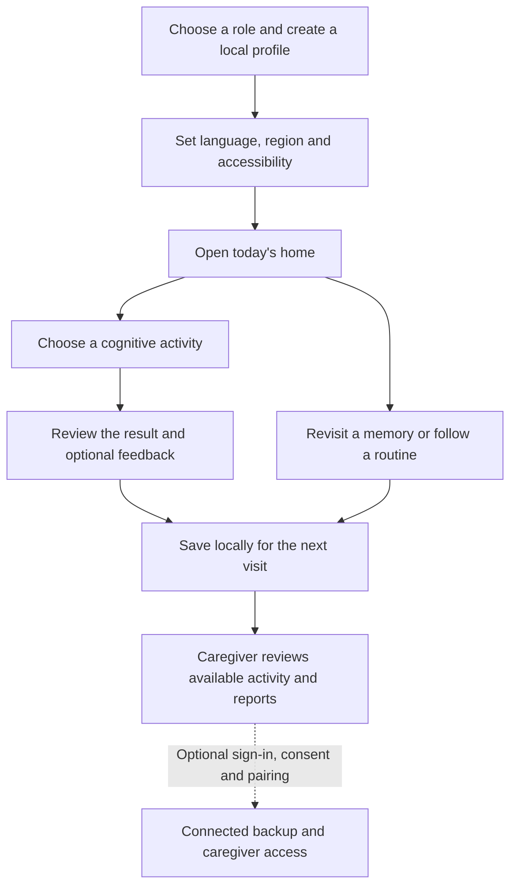
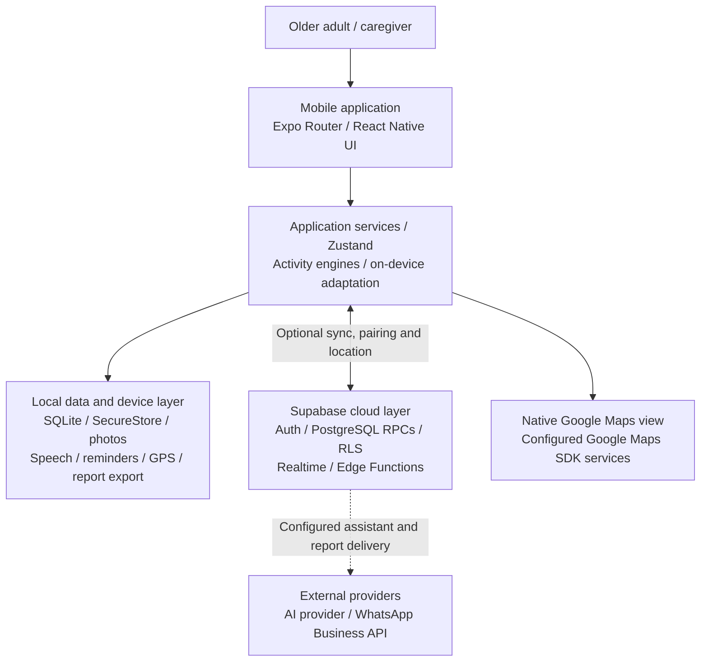
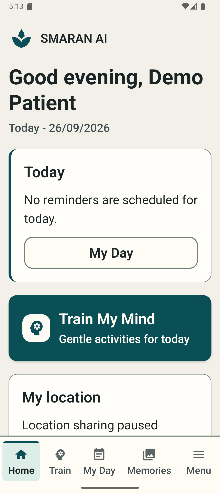
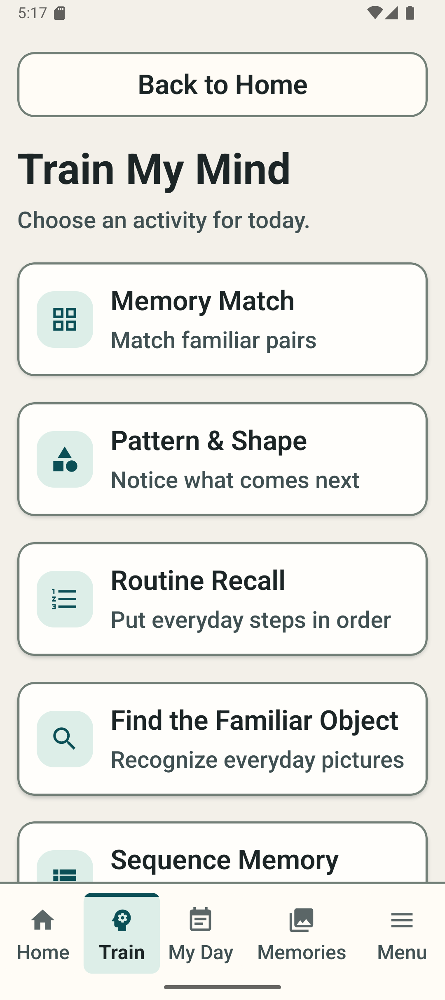
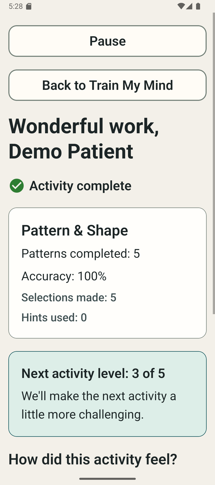
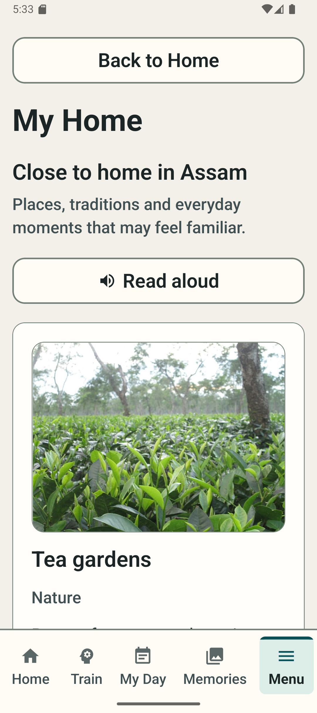
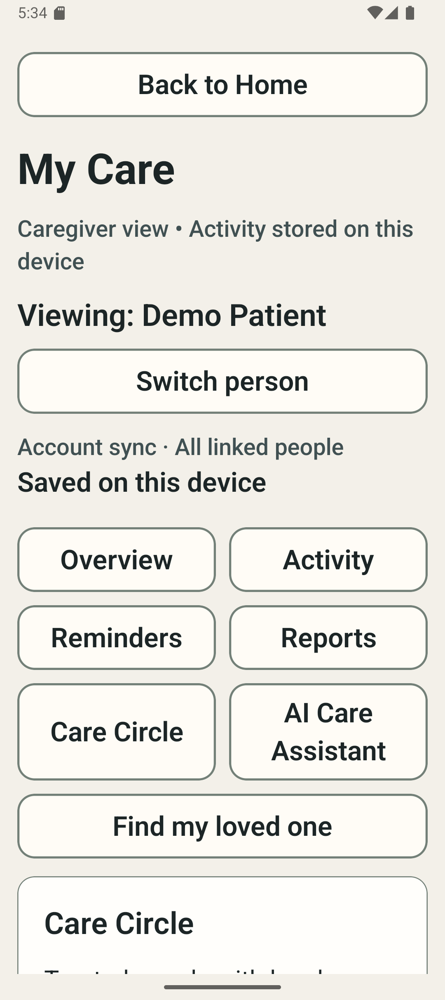
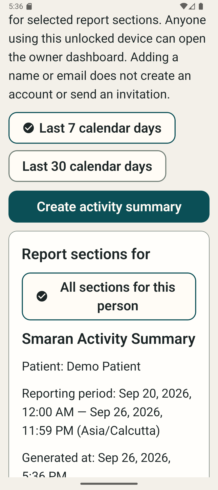

<h1 align="center">SMARAN AI</h1>
<p align="center"><strong>Familiar memories. Gentle challenges. Support for the everyday.</strong></p>
<p align="center">
  <strong>SIH PROBLEM STATEMENT · SIH26003</strong><br>
  <strong>TEAM ID · 130029 &nbsp; | &nbsp; PROJECT · SMARAN</strong>
</p>
<p align="center">
  An offline-first mobile companion for older adults with cognitive challenges and the people who care for them.<br>
  SMARAN brings cognitive activities, personal memories and daily routines together, with optional connected caregiver support.
</p>
<p align="center">
  <a href="package.json"></a>
  <a href="package.json"></a>
  <a href="package.json"></a>
  <a href="src/db/client.ts"></a>
  <a href="supabase/"></a>
</p>
<p align="center">
  <a href="#features">Explore the product</a> ·
  <a href="#journey">User journey</a> ·
  <a href="#architecture">Architecture</a> ·
  <a href="#evidence">Evidence</a> ·
  <a href="#validation">Validation</a> ·
  <a href="#setup">Run locally</a>
</p>

### At a Glance

| | SMARAN today |
|---|---|
| **Platform** | Native Android / iOS project; web is a limited preview |
| **Core experience** | Cognitive activities, familiar memories, daily routines and caregiver summaries |
| **Data & connectivity** | SQLite on the device; optional consent-based Supabase backup and connected services |
| **Adaptation** | On-device difficulty recommendations for each person and activity |
| **Readiness** | Core native features implemented; physical-device and hosted acceptance remain pending |

## 🎯 The Problem

A familiar face, a daily routine or a simple activity can become harder to navigate for an older adult living with dementia or age-related cognitive challenges. Caregivers need a practical way to support that day and understand what was recorded.

The [product brief](docs/product/PRD.md) also addresses unreliable connectivity, language barriers and culturally unfamiliar experiences in North-East India. SMARAN is designed around those everyday constraints, without assuming that an account or a reliable network is always available.

## 💡 The SMARAN Approach

| Everyday challenge | Product response |
|---|---|
| Connectivity comes and goes | Keep core activities, memories and routines on the device |
| An activity feels too demanding | Adjust the next difficulty gradually, with a plain-language explanation |
| Content feels unfamiliar | Bring personal photos and regional cultural content into the experience |
| Daily tasks become difficult to follow | Show today's routine, schedule local reminders and record completion |
| Caregivers need context | Offer factual summaries locally, with optional scoped access across accounts |
| Small controls or busy screens get in the way | Use large controls, adjustable text, appearance choices and optional read-aloud |

> SMARAN supports everyday engagement. It does not diagnose dementia, prescribe treatment or establish clinical improvement.

## ✨ What Sets SMARAN Apart

- **A useful local core.** Activities, saved memories, routines and on-device adaptation work without mandatory cloud sign-in on supported native devices.
- **Personal and regional familiarity.** User-managed memories sit alongside credited content from all eight North-Eastern states.
- **Explainable, bounded adaptation.** Difficulty is specific to a person and activity, with levels 1–5 and a maximum one-level change per recommendation.
- **Deliberate connected support.** Backup consent, caregiver access scopes and separate location-sharing controls make sharing an explicit choice.

<a name="features"></a>

## ✨ Feature Showcase

**✅ Implemented** means present in the current source, not accepted on every device or hosted environment. **⚠️ Partial** identifies a material delivery, configuration or review gap. See [validation](#validation) for the evidence boundary.

### 🧠 Cognitive Engagement

**✅ Implemented · Train My Mind**

Eleven activities cover matching, recall, patterns, sequences and gentle puzzles: Memory Match, Pattern Recognition, Routine Recall, Familiar Object, Sequence Memory, Picture Recall, Remember Lights, Number Path, Sudoku Lite, Chess Puzzle and Word Match.

### 🧩 Adaptive Personalization

**✅ Implemented · A level that follows the person**

The local engine uses completed activity records to recommend the next level. “Why this level” explains the recommendation; optional feedback updates that person's model for the activity. These are product difficulty settings, not clinical scores.

### ❤️ Familiar Memories

**✅ Implemented · My Memories**

Save a familiar photo with a name, relationship and description, then revisit it from the person's profile. Photos are managed as local files; cloud photo upload and restore are not implemented.

### 📅 Daily Routines

**✅ Implemented · My Day**

Create medicine, hydration, activity, appointment or custom reminders, scheduled once or daily. Record completion and see today's routine. Notification delivery depends on device permissions and native scheduling behavior.

### 👨‍👩‍👧 Caregiver Support

**✅ Implemented · Local support and scoped pairing**

Switch between local people, review recorded activity and maintain Care Circle contacts. Remote family/caregiver access uses expiring pairing codes, selected scopes and revocation; that connected path still needs hosted acceptance.

### ♿ Accessibility

**✅ Implemented · Preferences carried through the experience**

Adjust text size and appearance, reduce motion and use labelled controls with optional screen read-aloud. Physical-device accessibility and installed voice behavior remain to be verified.

### 🌏 Regional & Language Support

**✅ Bundled regional content · ⚠️ Language review pending**

My Home includes content from all eight North-Eastern states, with [image credits and sources](docs/product/NER_CONTENT_SOURCES.md). Seven UI catalogs cover English, Hindi, Assamese, Bengali, Meitei, Khasi and Mizo. Cultural copy includes English; native-speaker review and suitable device voices are still needed.

### 🗺️ Maps & Location

**⚠️ Partial · Foreground sharing with consent**

Native Google Maps, GPS freshness, safe-zone display and caregiver location updates are implemented. Sharing requires device permission, separate consent, native Maps keys and backend setup. Capture stops outside the foreground; this is not an emergency tracking service.

### ☁️ Cloud & Sync

**⚠️ Partial · Optional accounts and structured backup**

Email/password and Google sign-in, backup consent, a persistent sync queue and visible sync status are implemented. Local retry and isolation checks have passed; authenticated cross-account operation against the deployed backend remains unverified.

### 📄 Reports

**✅ Local reports · ⚠️ External delivery**

Generate factual 7/30-day activity summaries with native PDF sharing and email composition. WhatsApp delivery code requires server configuration, an approved provider template and end-to-end verification; opening a share sheet is not proof of delivery.

### 🤖 Assistant / AI

**⚠️ Partial · Bounded assistance**

Patient and caregiver assistant screens use an authenticated Edge Function with authorized factual context and an optional AI provider adapter. Provider-backed behavior is not yet verified. The separate `online-ai` instruction endpoint currently returns “not configured.”

<a name="journey"></a>

## 🧭 How SMARAN Works



Activities, memories and routines are choices from the home experience, not a mandatory sequence. The caregiver workspace also has its own entry; remote access is optional.

<a name="architecture"></a>

## 🏗️ Architecture



SQLite is the native local source of truth. General backup covers structured records; photo bytes and dates of birth are excluded. Location uses separate consent and bounded recent history. The web entry has no working SQLite adapter for the patient experience.

## ⚙️ Engineering Highlights

| Design choice | What it means in the code |
|---|---|
| **Durable local records** | SQLite migrations, foreign-key enforcement and transactions underpin profiles, activity, routines and the sync queue. |
| **Retryable structured sync** | A persistent outbox and authenticated push/pull preserve queued work across restarts. Automatic retries depend on foreground lifecycle and enabled backup. |
| **Scoped caregiver access** | Pairing grants selected permissions, with expiration and revocation. Report content is filtered by its underlying data scopes. |
| **Consent-aware location** | Device permission and sharing consent are separate. Pause/revoke controls and consent epochs limit stale location updates. |
| **Per-person adaptation** | Activity-specific model state and completed-session records drive bounded recommendations; feedback is optional. |
| **Local media and native boundaries** | Managed photo files, SecureStore sessions, device reminders, speech and native report sharing reuse platform capabilities. |

Explore the implementation in [services](src/services/), [local storage](src/db/), [adaptation](src/ai/), [sync](src/cloud/) and [backend migrations](supabase/migrations/).

## 🛠️ Technology Stack

| Layer | Technology | Purpose |
|---|---|---|
| Mobile | Expo SDK 54 · React Native 0.81 · React 19 · TypeScript | Native Android/iOS application |
| UI | Expo Router · React Navigation · custom React Native components | Routing, shared controls and accessible presentation |
| State | Zustand | Transient UI, preferences and session state |
| Local storage | Expo SQLite · SecureStore · FileSystem | Structured records, session material and personal media |
| Backend | Supabase client · Deno Edge Functions | Optional cloud workflows and provider boundaries |
| Database | SQLite locally · PostgreSQL with RPCs/RLS on Supabase | Versioned records and scoped server access |
| Authentication | Supabase Auth · Expo WebBrowser/Linking | Optional email/password and Google OAuth |
| AI | Custom TypeScript adaptation · optional server provider adapter | Difficulty recommendations and bounded assistance |
| Maps | react-native-maps · Expo Location · Supabase Realtime | Native Google Maps and foreground location updates |
| Device APIs | Expo Speech · Notifications · ImagePicker · Print · Sharing · MailComposer | Read-aloud, reminders, memories and report export |
| Testing | TypeScript · ESLint · Node assertions · SQLite/PostgreSQL fixtures | Static, regression and database checks |
| Build | Expo CLI · EAS Build | Native builds and static web export |

<a name="evidence"></a>

## 📱 Product Screenshots

| Home | Cognitive training |
|---|---|
|  |  |

| Adaptive activity result | Regional home |
|---|---|
|  |  |

| Caregiver view | Locally generated activity report |
|---|---|
|  |  |

All screenshots were captured from the running Android app. Capture details and the full evidence inventory are in [docs/SIH_EVIDENCE.md](docs/SIH_EVIDENCE.md).

## 🎬 Product Demo

[Watch or download the real Android app demo (MP4, 1:58)](assets/demo/SMARAN-Android-Demo.mp4). It was recorded from the running emulator; see [capture details](docs/evidence/android-pixel9a/README.md).

## 🏆 SIH Submission

| Field | Value |
|---|---|
| Problem Statement | `SIH26003` |
| Team ID | `130029` |
| Project | `SMARAN` |
| Submission Identifier | `SIH26003-TEAM-ID-130029-SMARAN` |

<a name="validation"></a>

## 🧪 Validation & Readiness

The [SIH validation report](docs/validation/SIH_VALIDATION.md) records commands, baselines, retries and limitations. Results below distinguish the earlier engineering validation from this README presentation phase; historical milestone reports are not fresh acceptance evidence.

### ✅ Verified

| Check | Evidence scope |
|---|---|
| TypeScript, ESLint and documentation links | Rechecked for Phase 2; presentation changes only |
| Regression entry points | 34/34 passed across the Phase 1 aggregate run and two targeted PostgreSQL retries; includes one helper-only entry point |
| Local database and pairing behavior | Disposable SQLite/PostgreSQL checks exercised persistence, retries, isolation, RPCs and SQL/RLS fixtures |
| Expo Doctor and dependency compatibility | Earlier presentation baseline: 18/18 Doctor checks and compatible dependencies; not rerun for Phase 2 |
| Android/iOS/web export | Earlier presentation baseline: Hermes bundles and 52 static web routes; this is bundle evidence, not device acceptance |

### ⚠️ Partial

Public Supabase Auth reachability passed in the recorded audit, but hosted migration history returned HTTP 406. Authenticated hosted push/pull, reconnect and cross-account RLS acceptance remain blocked by migration visibility and the absence of verified isolated test identities.

### ⏳ Pending Device / Hosted Verification

- Signed native builds, physical Android/iOS flows, TalkBack, reminders, Maps and report sharing.
- Deployed sign-in, cross-account sync, pairing and location updates against the intended backend.
- Live assistant provider and WhatsApp delivery; human review of regional language content.

<a name="setup"></a>

## 🚀 Run Locally

Use **Node.js 24 and npm** to run both the app tooling and the existing Node SQLite regression harness. Native development additionally needs the Android SDK/device or macOS with Xcode for iOS. Expo SDK 54's minimum Node version is 20.19; see the [versioned reference](https://docs.expo.dev/versions/v54.0.0/).

```sh
npm ci
# First setup only; preserve an existing .env:
cp .env.example .env
npx expo start
```

On PowerShell, use `Copy-Item .env.example .env` for the copy step. If script-wrapper policy blocks npm/npx, use `npm.cmd` and `npx.cmd`.

| Target | Command | Scope |
|---|---|---|
| Android / iOS | `npm run android` / `npm run ios` | Open the selected target from Expo CLI |
| Native Android build | `npx expo run:android --device` | Compile/install with the native toolchain |
| Native iOS build | `npx expo run:ios` | Compile/install using Xcode on macOS |
| Web preview | `npm run web` | Limited preview; native patient persistence is unavailable |

Core local use does not require cloud credentials. For optional accounts and backup, configure `EXPO_PUBLIC_SUPABASE_URL` and `EXPO_PUBLIC_SUPABASE_PUBLISHABLE_KEY`. Google sign-in also needs the provider and `smaran-ai://auth/callback` configured in Supabase. Review the [historical auth setup](docs/history/MVP24_AUTH_CLOUD_HARDENING.md) alongside [current migrations](supabase/migrations/).

<details>
<summary><strong>Maps, builds and backend configuration</strong></summary>

Native maps use `GOOGLE_MAPS_API_KEY` on Android and `GOOGLE_MAPS_IOS_API_KEY` on iOS through [app.config.js](app.config.js). Enable the relevant Maps SDK and restrict each key to that SDK and the actual app: Android `com.smaran.ai` plus the installed build's signing SHA-1; iOS bundle identifier `com.smaran.ai`. Native keys are bundled into builds, so restrictions remain necessary. Missing keys show the map-unavailable state; EAS builds require the selected platform's key. Follow the [SDK 54 Maps guide](https://docs.expo.dev/versions/v54.0.0/sdk/map-view/).

[eas.json](eas.json) defines `preview` for an internal Android APK and `production` for an Android AAB, using matching EAS environments:

```sh
npx eas-cli build --platform android --profile preview
npx eas-cli build --platform android --profile production
```

An AAB is not directly installable. iOS builds require Apple signing. The configured application version is `1.0.1`, Android version code `2`; build operators need access to the existing EAS project. Rebuild after native configuration changes.

Backend deployment is separate: inspect [Supabase migrations](supabase/migrations/), [functions](supabase/functions/), RLS, OAuth settings and server secrets. Assistant providers and WhatsApp delivery need their own configuration and acceptance. No build or deployment is performed by this documentation phase.

</details>

<details>
<summary><strong>Run the existing validation checks</strong></summary>

```sh
npx tsc --noEmit
npm run lint
node scripts/check-regressions.cjs
npx expo-doctor
npx expo install --check
npx expo export --platform all --output-dir .expo/sih-export
```

Regressions run sequentially, write ignored logs under `.expo/regressions/` and create disposable local databases. Install PostgreSQL tools; on Windows the default path is `C:\Program Files\PostgreSQL\18\bin`, or set `SMARAN_PG_BIN`. A successful export or local harness run does not establish physical-device or hosted acceptance.

</details>

## 🔒 Privacy & Security

- **On the device:** structured data lives in SQLite; personal photos are local files. SecureStore protects session material and selected values. The full SQLite database is not configured for SQLCipher encryption.
- **When sharing:** structured backup needs consent; remote caregiver access uses explicit scopes. Location adds device permission, separate consent and pause/revoke controls. Reports deliberately export selected information.
- **At the boundary:** shared-device profile switching is not private authentication between local users. Photo bytes and dates of birth are excluded from general cloud backup. Android OS backup is disabled by native configuration.
- **Secrets:** only [.env.example](.env.example) belongs in Git. Service-role, OAuth client and provider secrets stay server-side, never in `EXPO_PUBLIC_*` values.

Read [SECURITY.md](SECURITY.md) for reporting guidance and deployment boundaries. No clinical, regulatory or comprehensive security certification is claimed.

## ⚠️ Known Limitations

| Area | Current boundary |
|---|---|
| Native and hosted acceptance | Local tests use native-boundary adapters; real devices and the deployed backend still need end-to-end verification |
| Web | Native SQLite patient flows cannot initialize; this is a limited preview |
| Background operation | Automatic sync and location capture depend on foreground lifecycle; GPS and safe zones are not emergency guarantees |
| Speech and languages | Voices depend on device installation; speech-command recognition is absent, Bhashini is unavailable, and translations need human review |
| Media and delivery | No cloud photo upload/restore; WhatsApp and assistant providers are not verified live services |
| Clinical scope | No diagnostic accuracy, treatment benefit or improvement in dementia outcomes has been established |

## 👥 Team

**Team ID · `130029`**

> Verified SIH team details will be added before final submission.

<a name="documentation"></a>

## 📚 Documentation

Start with the **[documentation index](docs/README.md)** for the Phase 1 organization and the distinction between current references and historical records.

| Area | Read next |
|---|---|
| Product | [Requirements](docs/product/PRD.md) · [Design system](docs/product/DESIGN.md) · [Regional sources](docs/product/NER_CONTENT_SOURCES.md) |
| Architecture | [Sync behavior](docs/architecture/SYNC_STATUS.md) · [Technology intentions](docs/architecture/TECHSTACK.md) |
| Testing | [Native Android test plan](docs/testing/MVP13_NATIVE_ANDROID_TEST_PLAN.md) · [Regression scripts](scripts/) · [SQL fixtures](supabase/tests/) |
| Validation | [SIH validation report](docs/validation/SIH_VALIDATION.md) |
| Deployment | [Release 1.0.1 notes](docs/deployment/RELEASE_1.0.1.md) · [EAS profiles](eas.json) · [Backend configuration](supabase/config.toml) |
| History | [Milestone archive](docs/history/) · [Dated SIH requirement assessment](docs/history/SIH26003_REQUIREMENT_MATRIX.md) |

Product plans and milestone notes may describe intentions or superseded behavior. Use the current code, configuration and dated validation evidence to assess implementation. No project license has been selected; reuse permissions have not been established.
