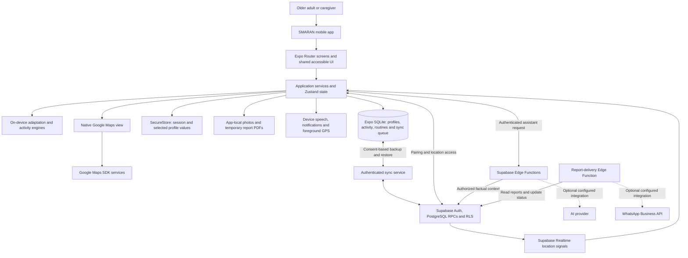

# SMARAN AI

**Memories that stay close. Support for every day.**

**SIH Problem Statement:** `SIH26003`<br>
**Team ID:** `130029`<br>
**Project:** `SMARAN`

An offline-first mobile companion for older adults with cognitive challenges and the people who care for them. Familiar memories, gentle activities and daily routines come together in one accessible experience.

**Built with:** Expo SDK 54 · React Native · TypeScript · SQLite · Supabase

[Explore features](#-key-features) · [How it works](#-how-smaran-works) · [Run locally](#-getting-started) · [Validation](#-testing--validation)

## 🌟 Overview

SMARAN supports cognitive engagement and everyday assistance for older adults experiencing dementia or age-related cognitive challenges, with particular attention to North-East India. The app combines adaptive activities, personal photos, reminders, regional content and caregiver summaries. Core native workflows save on the device; accounts and cloud services are optional additions.

SMARAN is not a diagnostic medical device. It does not diagnose dementia, prescribe treatment or replace professional care.

## 🎯 Problem

Memory, recognition and daily routines can become difficult for older adults with cognitive challenges. Family caregivers need a practical way to support those routines and understand recorded activity. The project's [product brief](docs/PRD.md) also identifies unreliable connectivity, language barriers and culturally unfamiliar content as design concerns for remote communities.

## 💡 Solution

SMARAN brings support into familiar daily actions: choose a gentle activity, revisit a family photograph, check today's routine, or explore something from home. Large controls, adjustable text and optional spoken guidance support the experience. Local SQLite storage keeps those activities available without an account; consent-based cloud features extend support to connected caregivers.

## ✨ Key Features

**Implemented** means the capability exists in the current code, not that every device or hosted integration has passed acceptance testing. **Partial** identifies a material configuration or delivery limitation.

| Feature | Description | Status |
|---|---|---|
| Train My Mind | Eleven activities: Memory Match, Pattern Recognition, Routine Recall, Familiar Object, Sequence Memory, Picture Recall, Remember Lights, Number Path, Sudoku Lite, Chess Puzzle and Word Match. | Implemented |
| Explainable adaptation | Per-person, per-activity difficulty levels 1–5, bounded changes and a “Why this level” explanation. Optional feedback updates the local model. | Implemented |
| My Day | Medicine, hydration, meal, activity and appointment reminders, local scheduling and recorded completion. | Implemented |
| My Memories | Personal photos, names, relationships and descriptions stored locally for familiar recall. | Implemented |
| My Home | Bundled cultural content covering all eight North-Eastern states; image sources are credited. | Implemented |
| Accessible experience | Adjustable text, contrast/appearance choices, reduced motion, labelled controls and device text-to-speech. | Implemented |
| Regional languages | Seven UI catalogs: English, Hindi, Assamese, Bengali, Meitei, Khasi and Mizo. Voice availability and human language review remain limitations. | Partial |
| Caregiver support | Person switching, local activity summaries, Care Circle contacts and factual 7/30-day reports with native PDF sharing/email composition. | Implemented |
| Accounts and backup | Optional email/password or Google sign-in, explicit backup consent, a persistent sync queue and visible sync status. Hosted acceptance remains outstanding. | Partial |
| Remote pairing | Expiring pairing codes, explicit access scopes and revocation for connected family/caregiver accounts. Requires the matching Supabase migrations. | Implemented |
| Location and Maps | Consented foreground GPS, a Google map, freshness indicators, safe-zone display and caregiver updates through Supabase. Requires native keys and backend setup. | Partial |
| Care assistant | Patient/caregiver assistant screens and an authenticated server gateway for bounded factual context and optional provider suggestions. Live provider validation is outstanding. | Partial |
| WhatsApp report delivery | Server-side delivery code exists; provider configuration, template approval and end-to-end delivery verification are still required. | Partial |

## 🧠 How SMARAN Works

1. **Make it familiar.** Choose a role, language, region and accessibility preferences; create or select a local person profile.
2. **Start with today.** The patient home brings routines, cognitive activities and familiar memories within reach.
3. **Practise at a comfortable level.** Complete an activity, review gentle feedback and optionally tell the app how it felt. Adaptation stays specific to that person and activity.
4. **Keep daily context close.** Add a photograph, revisit regional content or mark a reminder complete. Native local storage retains the record.
5. **Support together.** A caregiver can review locally available activity and reports. Optional sign-in, backup consent and scoped pairing enable cloud-supported workflows.
6. **Share location deliberately.** Enable device permission and sharing consent separately. Pause or revoke sharing when needed; location capture stops when the app leaves the foreground.

## 🏗️ Architecture



SQLite is the native local source of truth. Structured backup uses an outbox and authenticated push/pull operations; location has separate consent and retention rules. Personal photos are managed as local files, not through a working Supabase Storage upload path. The web entry has no SQLite persistence adapter for the patient experience.

## 🛠️ Technology Stack

| Layer | Technology | Purpose |
|---|---|---|
| Mobile | Expo SDK 54, React Native 0.81, React 19, TypeScript | Android/iOS application and typed domain logic |
| UI | Expo Router, React Navigation, custom React Native components, Zustand | Screen routing, shared controls and transient state |
| Local Storage | Expo SQLite, SecureStore, FileSystem | Structured records, protected small values and local media |
| Backend | Supabase JavaScript client, Deno Edge Functions | Optional authenticated cloud workflows and integration boundaries |
| Database | SQLite locally; PostgreSQL on Supabase | Versioned migrations, structured sync and server access policies |
| Authentication | Supabase Auth, SecureStore, Expo WebBrowser/Linking | Optional email/password and Google OAuth with session persistence |
| AI | Custom TypeScript adaptive engine; optional provider gateway | Local difficulty recommendations and constrained online assistance |
| Maps | `react-native-maps`, Expo Location | Native Google Maps rendering and foreground device coordinates |
| Cloud | Supabase RPCs, RLS and Realtime; Expo Network | Scoped backup/pairing, location notifications and reconnect handling |
| Device Features | Expo Speech, Notifications, ImagePicker, Print, Sharing, MailComposer | Spoken guidance, reminders, photos and report export |
| Testing | TypeScript, ESLint, Node assertion scripts, SQLite/PostgreSQL fixtures | Static checks and executable regression/contract checks |
| Build / Deployment | Expo CLI, EAS Build | Native builds and static web export |

## 📂 Repository Structure

| Directory | Purpose |
|---|---|
| [`app/`](app/) | Patient, caregiver, onboarding, account and admin routes |
| [`assets/`](assets/) | App branding, bundled regional images and reminder sound |
| [`components/`](components/) | Accessible controls and shared feature UI |
| [`constants/`](constants/) | Colors, typography, layout and encouragement text |
| [`docs/`](docs/) | Product briefs, implementation history and validation notes |
| [`hooks/`](hooks/) | Appearance, accessibility, haptics and activity hooks |
| [`plugins/`](plugins/) | Native backup configuration plugin |
| [`scripts/`](scripts/) | Standalone regression checks and asset tooling |
| [`src/`](src/) | Services, database/repositories, activities, adaptation, sync and translations |
| [`supabase/`](supabase/) | Backend migrations, SQL fixtures and Edge Functions |

## 🔒 Privacy & Security

- Keep real `.env` files local. Only the empty [`.env.example`](.env.example) belongs in Git; never commit credentials, private keys or personal evidence.
- Client configuration accepts a Supabase **publishable** key. Service-role, AI provider, WhatsApp and Google OAuth client secrets belong on the server, never in `EXPO_PUBLIC_*` values.
- Native structured records and personal photos remain on the device unless an implemented sharing/backup path is explicitly used. General backup excludes photo bytes and dates of birth; exported reports deliberately share selected information.
- Backup consent, account ownership and caregiver scopes govern cloud access. Location sharing has separate consent, pause/revoke controls and bounded recent history.
- SecureStore protects session material and selected values. The app does **not** configure SQLCipher encryption for the full SQLite database. Shared-device profile switching is not a private vault between local users.
- Android backup is disabled by app configuration and a native plugin. This does not establish complete device security or regulatory compliance.

See [SECURITY.md](SECURITY.md) for reporting guidance and deployment boundaries.

## ⚡ Offline-First

| Available on a supported native device without a network | Requires network or configured services |
|---|---|
| Local profile use, eleven activities and on-device adaptation | Sign-in, Google OAuth and account validation |
| Saved memories, bundled regional images and routine completion | Cloud backup/restore and remote pairing |
| Local reminders, subject to device permission/scheduling behavior | Caregiver updates from another device |
| Locally derived summaries and report generation | Assistant provider requests and WhatsApp delivery |
| Text-to-speech when a suitable offline voice is installed | Maps tiles/services; initial location-sharing consent and remote location updates |

The sync queue survives local restarts and retries while the app is foregrounded and backup is enabled. It does not promise background or closed-app delivery. Previously enabled foreground GPS can queue recent points while offline, but another device cannot receive them until connectivity returns.

## 🗺️ Google Maps

The native location component uses `react-native-maps` with `PROVIDER_GOOGLE`. Expo Location supplies coordinates; Supabase carries authorized remote updates. The web component displays an unavailable message rather than a working map.

| Variable | Native restriction |
|---|---|
| `GOOGLE_MAPS_API_KEY` | Android application `com.smaran.ai` and the SHA-1 fingerprint of the certificate that signs the installed build |
| `GOOGLE_MAPS_IOS_API_KEY` | iOS application bundle identifier `com.smaran.ai` |

Enable the matching Maps SDK in the Google Cloud project and restrict each key to the required SDK. Debug, EAS and Google Play signing certificates can differ; configure the certificate for the actual build being tested. Keys are supplied to native configuration by [app.config.js](app.config.js), not embedded in README examples or JavaScript extras. Native SDK keys are bundled into builds, so platform/API restrictions remain necessary.

Missing keys produce the app's map-unavailable state; EAS builds require the selected platform's key. Set it in the matching EAS environment and rebuild after changes. Follow the [Expo SDK 54 Maps configuration guide](https://docs.expo.dev/versions/v54.0.0/sdk/map-view/) for platform setup. Location is foreground-only and is not an emergency tracking service.

## 🚀 Getting Started

Use Node.js **20.19 or newer** for Expo SDK 54 and npm. The database regression harness additionally uses Node's built-in SQLite support; use Node.js 24 for that suite. Native runs need an Android SDK/device or, for local iOS builds, macOS with Xcode.

From the repository root, on macOS/Linux:

```sh
npm ci
cp .env.example .env
npx expo start
```

Windows PowerShell:

```powershell
npm ci
Copy-Item .env.example .env
npx expo start
```

Copy the example only on first setup; preserve an existing local `.env`. If PowerShell blocks npm's script wrapper, use `npm.cmd` and `npx.cmd`.

Core native use does not need cloud credentials. For optional accounts/backup, fill in `EXPO_PUBLIC_SUPABASE_URL` and `EXPO_PUBLIC_SUPABASE_PUBLISHABLE_KEY`. Read the [auth setup](docs/MVP24_AUTH_CLOUD_HARDENING.md) and inspect the [current migrations](supabase/migrations/) before enabling a backend: older milestone guides are not a complete current deployment checklist. Google sign-in also needs the provider and `smaran-ai://auth/callback` configured in Supabase.

## ▶️ Run the App

| Target | Command | Scope |
|---|---|---|
| Metro | `npm start` | Start the development server |
| Android | `npm run android` | Open the Android target from Expo CLI |
| iOS | `npm run ios` | Open the iOS target; local simulator requires macOS |
| Web | `npm run web` | Browser preview; native SQLite/SecureStore patient flows are unavailable |
| Local Android build | `npx expo run:android --device` | Compile/install with the Android toolchain and native modules |
| Local iOS build | `npx expo run:ios` | Compile/install with Xcode on macOS |

Use a native build for complete app/device verification. Starting Metro or opening a web preview does not verify notifications, native Maps, storage or report sharing.

## 🧪 Testing & Validation

```sh
npx tsc --noEmit
npm run lint
node scripts/check-regressions.cjs
npx expo-doctor
npx expo install --check
npx expo export --platform all --output-dir .expo/sih-export
```

The regression runner executes every other `scripts/check-*.cjs` entry point sequentially and writes logs to ignored `.expo/regressions/`. Database checks create disposable local test databases; PostgreSQL tools are required. On Windows, the default is `C:\Program Files\PostgreSQL\18\bin`, or set `$env:SMARAN_PG_BIN` to the installed tools directory.

| Check | Result for this presentation pass |
|---|---|
| TypeScript and ESLint | ✅ Passed |
| Expo Doctor and dependency compatibility | ✅ Passed; 18/18 Doctor checks, dependencies up to date |
| Regression entry points | ✅ Passed locally; 34/34 across the initial run and two targeted PostgreSQL retries |
| Local database and pairing checks | ✅ Passed with disposable SQLite/PostgreSQL data and SQL/RLS fixtures |
| Android/iOS/web export | ✅ Passed; Hermes bundles and 52 static web routes |
| Secret scan and documentation links | ✅ Passed; no real secrets found |
| Hosted cloud acceptance | ⚠️ Partial; public Auth reachability passed, but migration visibility and authenticated push/pull tests remain blocked |
| Physical devices, signed releases and external delivery | ⏳ Not yet verified in this pass |

See [SIH validation](docs/SIH_VALIDATION.md) for commands, retry history and the limits of each result. The regression count includes one helper-only entry point; it is not a count of independent test suites. Historical milestone results are not presented as fresh acceptance evidence.

## 📦 Build & Deployment

[eas.json](eas.json) defines two build profiles:

| Profile | Environment | Android output | Command |
|---|---|---|---|
| `preview` | `preview` | Installable APK for internal testing | `npx eas-cli build --platform android --profile preview` |
| `production` | `production` | AAB for Google Play distribution | `npx eas-cli build --platform android --profile production` |

An AAB is not a directly installable APK; see [Expo's APK build guide](https://docs.expo.dev/build-reference/apk/). For iOS, `npx eas-cli build --platform ios --profile production` requires Apple signing and the iOS Maps key. A static browser export uses `npx expo export --platform web`; it retains the web storage limitation.

The app is version `1.0.1` with Android `versionCode: 2`. EAS uses local version values and an existing project association in [app.json](app.json); build operators need access to that Expo project. Configure platform Maps values in the selected EAS environment before building.

Backend deployment is separate from EAS. Review ordered [Supabase migrations](supabase/migrations/), RLS, provider settings and function secrets before enabling cloud features. The `online-ai` instruction function currently returns “not configured”; the separate `ai-care-assistant` function has an optional provider adapter. WhatsApp delivery additionally requires its server configuration and an approved message template. This repository presentation pass does not deploy any backend, build a signed release or verify external delivery.

## 📱 Screenshots

> Real device screenshots will be added during final evidence capture.

## 🎬 Demo

> Real application demo recording will be added during final evidence capture.

## 📚 Documentation

| Area | Read next |
|---|---|
| Product | [Product requirements](docs/PRD.md) · [Historical SIH requirement assessment](docs/SIH26003_REQUIREMENT_MATRIX.md) |
| Architecture | [Sync behavior and boundaries](docs/SYNC_STATUS.md) · [Cognitive adaptation](docs/MVP20_COGNITIVE_AI.md) · [Regional content sources](docs/NER_CONTENT_SOURCES.md) |
| Testing | [Native Android test plan](docs/MVP13_NATIVE_ANDROID_TEST_PLAN.md) · [Regression scripts](scripts/) · [SQL fixtures](supabase/tests/) |
| Validation | [Current SIH validation](docs/SIH_VALIDATION.md) · [Historical database verification](docs/MVP26_LIVE_DATABASE_VERIFICATION.md) |
| Deployment | [Auth/cloud configuration](docs/MVP24_AUTH_CLOUD_HARDENING.md) · [Release 1.0.1 notes](docs/RELEASE_1.0.1.md) · [EAS profiles](eas.json) |

Milestone documents describe their named baselines and may include plans or superseded results. Use current code/configuration and the SIH validation report to assess today's scope.

## ⚠️ Known Limitations

- Local regression checks use native-boundary adapters. Their success and a completed export do not establish physical-device or hosted acceptance.
- Hosted authentication, cross-account sync, pairing, location updates and provider delivery require fresh end-to-end acceptance against the deployed backend.
- Web is a limited preview: the native SQLite patient workflow intentionally cannot initialize there.
- Location capture and automatic sync depend on foreground lifecycle; GPS accuracy, stale points and network loss limit remote visibility. Safe-zone indicators are not emergency alerts.
- Speech depends on installed device voices. Bhashini is an unavailable stub, speech-command recognition is not implemented, and regional text still needs native-speaker review. Some cultural content is in English.
- The online instruction endpoint has no provider wired. The care assistant and WhatsApp integration must not be presented as verified live services.
- Personal photos have no cloud upload/restore path. Shared-device local profiles are not isolated by cloud login.
- No clinical benefit, diagnostic accuracy or improvement in dementia outcomes has been established by this repository.

## 👥 Team

**Team ID:** `130029`

> Verified SIH team details will be added before final submission.

## 🏆 SIH Submission

| Field | Value |
|---|---|
| SIH Problem Statement | SIH26003 |
| Team ID | 130029 |
| Project | SMARAN |

Submission identifier: `SIH26003-TEAM-ID-130029-SMARAN`.

## 📌 Project Status

The native application implements local cognitive activities, memories, routines and caregiver support, with optional cloud features at different stages of integration and validation. The SIH presentation is grounded in that code; physical-device acceptance, hosted integration checks, reviewed team details and real evidence remain outstanding.

No project license has been selected. A license decision is required before reuse permissions can be stated.
