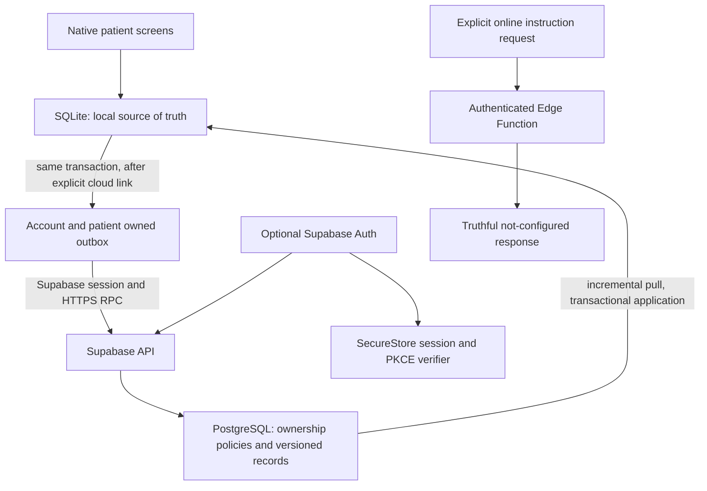

# MVP-22: optional accounts, structured sync, and AI gateway foundation

The final source audit is recorded in section 31. Sections 1-30 retain the implementation-time evidence and Git snapshot; their uncommitted-file inventory is historical, not the current working tree.

Validated on 2026-09-12 in `C:\Users\Dharmin\OneDrive\Desktop\SMARAN-A`, branch `feature/mvp22-auth-sync`, against `58e7938ab71f47f3080ac9d1ec355c07f0ec30ca` / `smaran-mvp21-stable`.

The source implementation and local checks are complete. Live Supabase, Google, PostgreSQL/RLS, Edge Function deployment, and physical-device validation remain pending. No commit, push, merge, tag, APK build, production deployment, or live patient database mutation was performed.

## 1. Architecture audit

The audit covered the package/lockfile, Expo configuration and Router tree, bootstrap/recovery, SecureStore, profile switching and patient-session revisions, migrations 001–007, every domain repository, notification/media queues, account/menu surfaces, web storage boundary, and cognitive services.



Existing Expo SDK 54, React Native 0.81.5, React 19.1, Expo Router, Zustand, SQLite repositories, and UI components remain in use. SQLite already verifies WAL/FKs and runs migrations in exclusive transactions. Notification/media operations have existing serialized queues; there was no cloud outbox. The service named `online-trainer` is local adaptive math, not a network provider. The deterministic coach is unchanged.

Auth initialization is independent of database bootstrap. Patient home, games, My Day, Memories, My Home, and local My Care do not require an account or network. `src/db/client.web.ts` remains unchanged: native SQLite is deliberately unavailable on web. The web account route can render the configuration/native-platform explanation; this is not web SQLite sync.

## 2. Dependencies and configuration

| Added direct dependency | Version | Purpose |
| --- | --- | --- |
| `@supabase/supabase-js` | `2.116.0` | Official Auth, RPC, and Functions client |
| `react-native-url-polyfill` | `4.0.0` | Native URL contract used by Supabase |
| `expo-crypto` | `~15.0.9` | Native secure randomness and SHA-256 for S256 PKCE |

The existing `expo-secure-store`, `expo-web-browser`, and `expo-linking` are reused. Expo Crypto was installed with `npx expo install`. All previous dependency versions and pre-existing lockfile entries are preserved. Expo, React Native, app identity, permissions, build configuration, and private-backup plugin are unchanged. `app.json` already had the scheme `smaran-ai`; no config edit was needed. The mobile TypeScript project excludes only the Deno Edge Function entry point.

Only these public client values are accepted:

```dotenv
EXPO_PUBLIC_SUPABASE_URL=
EXPO_PUBLIC_SUPABASE_PUBLISHABLE_KEY=
```

`.env.example` contains empty values. `.env` and `.env.*` are ignored, with the example explicitly allowed. The client requires an HTTPS origin and a modern `sb_publishable_` key. Missing/invalid configuration yields “Cloud sync is not configured on this build.” Local patient use continues. Legacy anon JWT keys are not accepted by this client contract; use a modern publishable key.

Configuration steps for a separate, authorized staging setup (not executed here):

1. Create/select a Supabase project and apply `supabase/migrations/20260912000000_auth_sync.sql`. Run the disposable server test below before enabling a build.
2. Enable email/password authentication and configure confirmation email delivery. Confirmation can finish in the browser; the user then signs in in Smaran.
3. Enable Supabase's Google provider. Configure the Google web OAuth client with the provider callback shown by Supabase. Keep the Google client secret in the server dashboard only.
4. Allowlist the exact app redirect `smaran-ai://auth/callback` in Supabase Auth. Configure the public project URL and publishable key in the ignored local environment/build configuration.
5. Validate Google with a supported native build carrying the custom scheme. Expo Go is not evidence that this app's custom-scheme OAuth works. No native build/APK was produced in this task.
6. If separately deploying the gateway, use its Supabase server runtime configuration and verify its authentication behavior. No AI-provider configuration is needed for the truthful not-configured contract.

Implementation references read before integration: [Expo SDK 54](https://docs.expo.dev/versions/v54.0.0/), [SecureStore](https://docs.expo.dev/versions/v54.0.0/sdk/securestore/), [WebBrowser](https://docs.expo.dev/versions/v54.0.0/sdk/webbrowser/), [Linking](https://docs.expo.dev/versions/v54.0.0/sdk/linking/), [Crypto](https://docs.expo.dev/versions/v54.0.0/sdk/crypto/), [Supabase React Native auth](https://supabase.com/docs/guides/auth/quickstarts/react-native), [native deep linking](https://supabase.com/docs/guides/auth/native-mobile-deep-linking), [PKCE](https://supabase.com/docs/guides/auth/sessions/pkce-flow), and [Google OAuth](https://supabase.com/docs/guides/auth/social-login/auth-google). The installed Supabase SDK source was also inspected and exercised.

## 3. SQLite migration 008

Exactly one new local migration, `008_auth_sync.ts`, adds five infrastructure tables:

| Table | Device-local purpose |
| --- | --- |
| `sync_accounts` | Linked owner, pull cursor, link time, last completed sync |
| `sync_installation` | Random installation ID, default owner for newly created profiles, transactional pull suppression |
| `sync_patient_owners` | One permanent account association per local patient |
| `sync_outbox` | Immutable mutation identity/payload, account/patient, local order, retry state |
| `sync_versions` | Last applied server version per account/entity |

The migration adds indexes and triggers, without changing/rebuilding domain tables. Ownership and event identity have explicit trigger protection. The outbox requires valid JSON, an exact field allowlist, matching account/patient/entity identities, a unique random mutation ID, a bounded payload, and classified retry state. Explicit ownership checks also protect connections with FK enforcement disabled. Auth tokens are never stored in SQLite.

## 4. Data preservation results

`node scripts/check-auth-sync-migration.cjs` passed using real Node SQLite and the actual migration runner. It populated all seven domain tables for two synthetic patients before migration 008, then verified every previous row and rowid, original schema/index definitions, an extra preservation-check index, and foreign keys. Four injected migration failures rolled back. Fresh creation with FKs on/off passed. Historical migration source comparisons, bootstrap idempotence, malformed-event rejection, and immutable ownership/event checks passed.

No actual patient database was used or reset. Migrations 001–007 remain unchanged. Existing regression expectations were narrowly updated from seven migrations to eight; preservation assertions continue comparing all historical tables/indexes. Dependency and architecture guards now permit only the explicit MVP-22 additions.

Rollback means transaction rollback if migration 008 fails before commit. There is no down migration or verified binary-downgrade path after it succeeds. Preserve the database and queued ownership records and use a forward repair; deleting sync tables/triggers, resetting the database, uninstalling, or restoring an older backup is not an automatic recovery procedure. Any downgrade or backup restoration needs separate authorization and data-preservation validation.

## 5. Auth architecture

`src/cloud/auth.ts` uses Supabase Auth with persisted native sessions, PKCE, URL session detection disabled, and foreground refresh lifecycle management. Zustand exposes account identity/status/revision only; tokens stay inside the SDK and its secure storage adapter. No password is persisted or hashed by the app.

The SecureStore adapter writes bounded chunks into two banks and commits the manifest last. An interrupted write preserves the prior committed session. Reads, writes, corrupt values, and deletions fail explicitly; an unknown storage state never silently becomes a signed-out session. Storage hydrates before SDK construction to avoid the installed SDK's unhandled initial-session storage-read path. SDK PKCE flow indexes/verifiers are included.

A durable logout marker records flow IDs before deleting session material. Restart can finish a requested logout even if deletion interrupted the flow index itself. The marker is removed only after cleanup succeeds. Auth requests have a 15-second timeout covering response consumption, account-generation invalidation, and a response-size check. SecureStore failure stops requests/sync and offers retry while leaving patient records intact.

## 6. Email/password result

Sign-up, confirmation-required response, sign-in, session persistence/restoration, error handling, and no password persistence passed with the real installed Supabase SDK and controlled network/SecureStore boundaries. New passwords require at least eight characters; existing-account sign-in does not impose a new minimum. Email/password fields enable legitimate autofill and secure password entry. Live email delivery, confirmation, and hosted sign-in were not tested because no project credentials were available.

## 7. Google result

The production path requests Supabase's Google provider, verifies the returned project origin and S256 challenge, opens an Expo auth browser session, validates the exact callback, and exchanges its authorization code using the saved verifier. Native crypto provides secure randomness/SHA-256 when absent; there is no insecure PKCE fallback. Cancellation clears the verifier. Duplicate callback handling avoids exchanging the same callback twice.

Controlled tests passed for real SDK S256 generation, successful code exchange against a controlled transport, persistence, cancellation, invalid/deceptive routes, duplicate/unknown callback parameters, and fragment/token rejection. **Real Google end-to-end is BLOCKED** pending Supabase/Google configuration and native-device execution. No fake local Google account is created.

## 8. Logout and local mode

Logout immediately invalidates the account revision, aborts in-flight requests, stops synchronization/refresh, clears account-scoped transient state and password inputs, and calls Supabase `signOut({ scope: 'local' })`. Secure session, user, and PKCE material are explicitly removed. If the server is unreachable, the device signs out and reports that remote revocation could not be completed. An already issued remote token is not claimed to have been revoked offline.

Profiles, reminders, memories, history, active patient, onboarding state, and queued owner associations remain. The app continues locally. SecureStore deletion failure leaves an explicit retry state with cloud access stopped; restart/retry completes the requested logout instead of restoring that account.

## 9. PostgreSQL schema

`supabase/migrations/20260912000000_auth_sync.sql` creates four server tables in a transaction:

| Table | Purpose |
| --- | --- |
| `sync_accounts` | Auth-user UUID and per-account committed version counter/timestamps |
| `sync_patients` | Separate text patient IDs scoped to that owner |
| `sync_records` | Seven typed structured entity payloads, patient owner, version, timestamps, memory tombstones |
| `sync_mutations` | Account-scoped mutation identity, original request, accepted version, creation time |

The JSON record envelope avoids copying local implementation columns while enforcing exact entity-specific fields, types, sizes, and domain constraints in `valid_sync_record`. This is not arbitrary JSON upload. Existing patient IDs remain text; Supabase account IDs are UUIDs. Records and mutation receipts remain durable; automatic tombstone/receipt retention cleanup is deferred because old offline replay must remain safe.

## 10. RLS and evidence level

All four tables enable RLS and have authenticated owner policies with both `USING (auth.uid() = owner_id)` and `WITH CHECK`. Direct INSERT/UPDATE/DELETE privileges are revoked; authenticated SELECT remains constrained by RLS. Writes use RPC. Both privileged RPCs require a non-null `auth.uid()`, scope every data operation to that owner, and use an empty `search_path`. Anonymous/public RPC execution is revoked. The client cannot supply a different owner argument.

**Evidence: static SQL/security assertions and source inspection passed. Actual PostgreSQL/RLS execution was not performed.** Static assertions cover SELECT/INSERT/UPDATE/DELETE policy clauses on every table, explicit RPC ownership, grants, idempotency, and version locking. This does not prove hosted behavior or SQL application success.

`supabase/tests/auth_sync.sql` is a ready-to-run disposable server test, not an executed result. After applying the migration to a disposable local Supabase database, run it using an owner connection. It creates synthetic A/B users, checks push/replay/conflict/incremental pull, verifies production direct-write revocation, then temporarily grants DML within the test transaction to isolate the four RLS operations. A cannot select/update/delete B or insert as B; anonymous RPC is rejected. Everything, including temporary grants, rolls back. Do not run fixtures against a patient production database.

Server design references: [Supabase RLS](https://supabase.com/docs/guides/database/postgres/row-level-security), [database functions and security](https://supabase.com/docs/guides/database/functions), and [PostgreSQL function volatility/snapshot behavior](https://www.postgresql.org/docs/current/xfunc-volatility.html).

## 11. Persistent-data inventory

Classification: A = syncable structured patient data; B = device-only/local state; C = private media with no cloud transfer; D = transient/cache state.

| Existing table/state | Class | Sync treatment |
| --- | --- | --- |
| `patient_profiles` | A, with B legacy column | ID, preferred name, age bracket, emergency name/phone, creation/update times; excludes legacy `user_id` |
| `patient_settings` | A, with B row ID | Patient, language, region, text size, contrast, voice guidance, reduced motion, update time; local settings row ID excluded |
| `reminders` | A, with B notification state | Patient, type/title/note, schedule, repeat/enabled state, deletion and creation/update times; notification ID/revision excluded |
| `reminder_events` | A, with B integer row ID | Patient, reminder, scheduled occurrence, completion/status/times; local autoincrement ID excluded |
| `cognitive_sessions` | A, except demo rows B | Completed session metrics, activity/difficulty, feedback and timestamps; seeded demonstration sessions excluded |
| `adaptive_model_state` | A | Patient/activity, bounded model weights/bias, sample count, update time |
| `personal_memories` | A text, C photo | ID/patient, name/relationship/description, creation/update times; `photo_path` excluded |
| `schema_migrations` | B | Never uploaded |
| `sqlite_sequence` | B | Never uploaded |
| Five new SQLite sync tables | B | Protocol bookkeeping; not blindly mirrored/uploaded as tables |
| SecureStore DOB, onboarding, active profile, appearance, pending additional-person marker | B | Never uploaded |
| SecureStore account tokens/verifiers/logout state | B | Secure auth adapter only; not outbox data |
| Managed personal photo files | C | Device-only binaries |
| Zustand selections, account status, notifications/media work queues, caches | D | No persisted cloud record |

Wire identity uses the existing ID for profiles/reminders/sessions/memories, patient ID for settings, `patient:activity` for adaptive state, and `reminder:scheduled-date` for daily completion identity. The frozen `SYNC_COLUMNS_V1` is the precise payload allowlist.

## 12. Transactional outbox result

SQLite triggers capture domain mutations inside the same transaction/statement as the save. A failed outbox insertion aborts the domain change, including autocommit saves. There is no “save now, enqueue later” path. Tests inject outbox failures for updates and memory deletion and confirm rollback. Local-only patients have no queue. Notification bookkeeping and photo-path-only changes do not create cloud payloads. Pulled changes temporarily suppress capture inside the exclusive apply transaction, preventing echo.

## 13. Initial bootstrap and ownership

Sign-in alone does not enable first-time upload. The explicit **Enable backup and sync** action links only unowned local profiles, preserving IDs and existing records, and generates their complete eligible snapshots in the same SQLite transaction. Unique patient ownership makes repeat linking idempotent. The synthetic seven-table/two-patient fixture produces 14 initial events once.

Existing associations never move to another account. Once linked, later offline edits stay queued for that owner, including after logout. Newly created profiles use the last enabled/default account until another account enables sync or a previously linked account becomes active. Merely signing in to a new, unlinked account does not claim already-associated patients. Returning linked accounts resume their own pending work. Initial snapshotting is one transaction; very large histories can make first linking take longer, while transfer proceeds in bounded passes.

## 14. Push and pull

Push sends up to 25 events in local sequence order to `push_mutations`, for at most ten batches per pass. Only matching, ordered, confirmed applied/duplicate receipts remove events. Partial failure preserves rejected/unsent work; server processing stops accepting later batch entries after its first rejection.

Pull runs after that account's local queue is drained. `pull_changes` returns up to 25 changed records, a monotonically increasing account cursor, current required parents, and `has_more`. A per-account server row lock holds version assignment through commit, preventing an uncommitted earlier version from being skipped. The STABLE pull uses one calling snapshot for records/parents/cursor state.

Each local batch validates owner, identities, fields, bounds, order, and expected cursor. Parents apply before children; per-entity versions prevent replay or an older parent overwriting a newer one. Application, cursor update, and echo suppression are one exclusive transaction with account checks before and after. A concurrent local write, stale account, or invalid batch rolls back without advancing the cursor. At most ten pull batches run per pass; later foreground passes continue.

## 15. Retry and idempotency

Mutation IDs remain unchanged through retry/restart. The server's `(owner, mutation_id)` ledger recognizes identical replay; the same ID with a different request conflicts. A lost receipt can replay without another row/version. Local tests exercise duplicate/partial receipts and lost-response reconnect using controlled RPC boundaries.

Push failure is classified as network, auth, server, invalid, or conflict. Backoff starts at two seconds, increases exponentially, and is capped at five minutes. After eight failures the event needs attention; invalid/conflict events stop immediately. Older waiting/failed work is not skipped. Manual **Sync now** explicitly resets attempts. Malformed receipts also consume retry budget. There is no automatic infinite push retry; a permanently invalid head blocks that account's later push/pull until addressed. Periodic read-only pull/connection attempts can continue while the foreground app runs.

## 16. Conflict policy

Mutable profiles/settings/reminders/adaptive state/memory text use **last server-accepted write**, ordered by committed server version, not device clocks. This is a whole-record rule, without field merging. A later-arriving offline edit can win over an earlier accepted edit.

Cognitive sessions and daily completion history use **first server-accepted record** for an existing identity. This protects history from destructive replacement; later changes to that same history identity, including feedback after initial acceptance, do not replace the server copy. Adaptive state remains mutable. Memory tombstones and soft-deleted reminders are terminal: stale clients cannot resurrect them. Re-creation requires a new ID. Existing local immutable-history collisions are not overwritten during pull. No AI resolves conflicts.

## 17. A/B account isolation

Queue, cursor, receipts, versions, and patient associations are owner scoped. Account generation changes abort requests and invalidate captured continuations before local acknowledgement/application. Controlled tests cover A login, pending writes, logout, B login, stale A responses, B seeing/sending no A work, and A returning to resume its own queue. SecureStore failure also invalidates the generation.

Cloud isolation does not make local profiles private from another person using the same unlocked device. The consent copy states this. Account logout does not hide/delete shared local patient data, and no Care Circle or cross-account sharing permissions were added.

## 18. Patient isolation

Account ownership is separate from active-patient selection. One account can own multiple patients. Pulled parent/entity identities are checked before UPSERT; cross-patient entity collisions, cross-account profile IDs, and collisions with unowned local patient IDs stop application. Existing patient selection/session revision guards remain intact. Pull never automatically selects a newly received patient. Existing routing/reload and notification reconciliation paths pick up local database changes; immediate refresh of every already-open screen or notification is not claimed.

## 19. Offline and reconnect

Local saves never wait for Supabase. Queued writes survive database close/reopen and sign-out. Foreground entry and a 30-second foreground poll retry eligible authenticated work, without another native networking dependency. Bounded requests and status errors isolate DNS/server/auth-refresh failures from local patient use. Auto-refresh is resumed even after transient initialization network failure. No background sync guarantee or instant radio-change detection is claimed.

## 20. Status UX and browser QA

Menu → Account & Sync uses the existing visual system, scroll wrapper, accessible labels, large actions, password security, and autofill overrides. It shows Local only, Signed in, Offline, Syncing, Up to date, changes waiting, attention, and last completed sync. Storage errors and offline logout have factual plain-language messages. Password/email/message transient inputs clear across account revision changes.

Real Playwright checks used the running Expo web `/account` route at `http://localhost:8083/account`: 360, 768, and 1280-pixel widths, keyboard navigation/local exit, read-only unconfigured fields, secure password/autofill attributes, disabled unavailable auth actions, and dark/reduced-motion rendering. No horizontal overflow was observed; measured actions were at least 60 pixels high. The local exit returned to the existing web native-storage recovery boundary. No cloud request was sent. Expected diagnostics were the intentional local-storage bootstrap failure and Expo's web notification-listener warning. Browser QA did not prove native SQLite or authenticated native UI.

All seven catalogs have matching keys/placeholders. New account copy uses explicit English fallback where reviewed regional translation is unavailable; Hindi/Assamese/Bengali have some translated labels. Full native-speaker review remains pending, particularly Meitei, Khasi, and Mizo.

## 21. Online AI gateway foundation

`supabase/functions/online-ai` accepts only authenticated POST requests. The server entry verifies the bearer token with Supabase `auth.getUser`; configuration disables the legacy platform JWT check because authentication is performed explicitly in the handler. Verification has a ten-second network bound. This setting does not make the handler accept unauthenticated requests. See [Edge Function authentication](https://supabase.com/docs/guides/functions/auth) and [server secrets](https://supabase.com/docs/guides/functions/secrets).

The body is streamed with a 1,024-byte cap and must contain exactly `{ version: 1, task: 'game-instruction', activity, language }`, with six allowed activities and seven languages. Passwords, token fields, arbitrary prompts, SQL, patient identifiers/histories, and unknown fields are rejected. The bearer token travels only in the authentication header, not the AI payload.

There is no provider call or fabricated generation: a valid request returns HTTP 503 with a structured `not-configured` error and “Online AI enhancement is not configured.” The client helper is explicit and is not automatically called by gameplay. The existing deterministic offline coach continues unchanged. No diagnosis, staging/severity/progression estimate, treatment change, prescription, or clinical improvement claim is generated. Contract/auth/size/error tests passed against the handler with a controlled verifier; the actual Deno runtime/deployed auth endpoint was not exercised.

## 22. Secrets and security audit

The requested conflict-marker, private-credential, database-URL, provider-key, password-assignment, and loopback patterns were scanned across production/server/config and repository files. No private credential, raw database connection, provider secret, merge conflict, or production loopback endpoint was found. Matches were test assertions and historical/test documentation, including the browser QA address in this report; they were interpreted separately. `.env.example` is empty and ignored live-env names are protected. No token, password, or session is included in logs/outbox payloads.

`git diff --check` passed. Existing migrations, app/EAS identity, private-backup configuration, web SQLite boundary, cognitive behavior, and patient-switch architecture remain protected by runnable checks. No microphone/STT configuration, sharing permissions, additional local migration, destructive reset, or prohibited build/deployment operation was added.

## 23. Media limitations

Only memory text/metadata syncs. A receiving device gets no photo binary or local path. Existing local photo paths survive remote metadata updates. A remote memory tombstone deletes its local metadata but deliberately does not perform filesystem cleanup; a previously stored private photo can remain orphaned until a separately designed cleanup flow. Date of birth and other SecureStore settings remain device-only. This is structured backup, not full-device or photo backup.

## 24. Files changed

The complete tracked/untracked inventory and exact status are recorded in section 29. Main additions are the optional account/callback routes, seven cloud modules, migration 008 and sync repository, account strings, three validation helpers, the server migration/RLS test, gateway/config, safe env example, and this report. Existing edits are limited to bootstrap/menu wiring, migration registration, SecureStore key typing, catalogs/privacy copy, dependency/config boundaries, narrow legacy test updates, ignore rules, and the README link.

## 25. Regression results

All 19 scripts completed successfully (exit 0):

| Command (`node scripts/…`) | Result |
| --- | --- |
| `check-auth-sync.cjs` | PASS; also rerun after interrupted-logout regression/fix |
| `check-auth-sync-migration.cjs` | PASS |
| `check-daily-voice.cjs` | PASS |
| `check-cognitive-migration.cjs` | PASS |
| `check-cognitive-ai.cjs` | PASS |
| `check-profile-switching.cjs` | PASS |
| `check-visual-ux.cjs` | PASS |
| `check-privacy-recovery.cjs` | PASS |
| `check-analytics.cjs` | PASS |
| `check-cognitive-expansion.cjs` | PASS |
| `check-my-care.cjs` | PASS |
| `check-my-day.cjs` | PASS |
| `check-my-memories.cjs` | PASS |
| `check-my-home.cjs` | PASS |
| `check-native-hardening.cjs` | PASS |
| `check-product-hardening.cjs` | PASS |
| `check-product-polish.cjs` | PASS |
| `check-ux-overhaul.cjs` | PASS |
| `check-elderly-ux.cjs` | PASS |

`check-mvp22-boundaries.cjs` is a shared assertion module invoked by the regression checks. Local test logs/results reside in ignored `.expo/mvp22-checks`; generated browser scratch files were removed. No production mock or browser SQLite bridge was introduced.

## 26. Toolchain and exports

| Command | Result |
| --- | --- |
| `npx.cmd tsc --noEmit` | PASS |
| `npx.cmd expo lint` | PASS |
| `npx.cmd expo-doctor` | PASS, 18/18 checks |
| `npx.cmd expo install --check` | PASS, dependencies up to date |
| `npx.cmd expo config --type public` | PASS, existing identity/scheme intact |
| `npx.cmd expo export --platform all` | PASS: Android, iOS, and web |

Validation used Node 24.19.0. Android and iOS exports each produced a 5.75 MB Hermes bundle; web produced a 3.53 MB JavaScript bundle with 36 static routes, including account/callback. Export is not a device test or APK build. Expected environment color-variable warnings and Expo's existing web notification warning do not indicate export failure.

## 27. Cloud tests blocked by environment

No live cloud end-to-end test was completed. The following remain BLOCKED here:

- Hosted email creation/delivery/confirmation/sign-in, session refresh/revocation, and real Google provider authorization/callback.
- Applying/parsing the migration in actual PostgreSQL, executing `supabase/tests/auth_sync.sql`, hosted RLS enforcement, and concurrent multi-client commit-order tests.
- Real two-device push/pull/reconnect, hosted receipt replay, and schema/PostgREST compatibility.
- Deno entry-point execution, Edge Function deployment, and real token verification at the deployed gateway.

No Supabase/Google credentials were supplied. `psql`, Supabase CLI, and Deno were unavailable. Docker CLI existed but its daemon was unavailable; no unsafe global setup or database provisioning was attempted. Static SQL tests, real-SDK controlled auth tests, real local SQLite tests, and controlled gateway/RPC tests are the exact completed evidence, not substitutes for the blocked tests.

## 28. Physical-device tests remaining

Use separate synthetic accounts/patients on supported Android/iOS devices to verify:

- Existing populated-device migration and local use through airplane mode, process death, restart, and SecureStore errors.
- Real email/autofill/confirmation and Google warm/cold callback, cancellation, interrupted browser flow, session restore, token expiry, and logout/restart.
- Real native S256 crypto, secure chunk storage, background/foreground transitions, radio/DNS loss/reconnect, and stale A requests followed by B login.
- Two-device bootstrap, long backlogs, partial failure/replay, mutable conflicts, terminal deletions, patient collisions, and incoming reminder notification reconciliation.
- Account layouts at large text sizes, TalkBack/VoiceOver, keyboard behavior, high contrast, seven-language review, and clarity of structured-only/photo exclusions.

## 29. Exact Git audit

The final audit commands are `git diff --check`, `git status --short`, `git diff --stat`, `git diff --name-status`, and `git ls-files --others --exclude-standard`. HEAD and the baseline tag remain identical. Nothing is staged or committed. The exact final output and expanded untracked-file inventory follow below.

Branch: `feature/mvp22-auth-sync`. HEAD and tag: `58e7938ab71f47f3080ac9d1ec355c07f0ec30ca`. There are 42 changed/new files: 20 modified tracked files and 22 untracked files. Nothing is staged.

Exact `git status --short`:

```text
 M .gitignore
 M README.md
 M app/_layout.tsx
 M app/patient/menu.tsx
 M package-lock.json
 M package.json
 M scripts/check-cognitive-expansion.cjs
 M scripts/check-cognitive-migration.cjs
 M scripts/check-daily-voice.cjs
 M scripts/check-my-care.cjs
 M scripts/check-my-day.cjs
 M scripts/check-my-memories.cjs
 M scripts/check-native-hardening.cjs
 M scripts/check-visual-ux.cjs
 M src/db/migrations/index.ts
 M src/i18n/regional-strings.ts
 M src/i18n/strings.ts
 M src/i18n/ux-strings.ts
 M src/services/secure-storage.service.ts
 M tsconfig.json
?? .env.example
?? app/account.tsx
?? app/auth/
?? docs/MVP22_AUTH_SYNC.md
?? scripts/check-auth-sync-migration.cjs
?? scripts/check-auth-sync.cjs
?? scripts/check-mvp22-boundaries.cjs
?? src/cloud/
?? src/db/migrations/008_auth_sync.ts
?? src/db/repositories/sync.repository.ts
?? src/i18n/account-strings.ts
?? supabase/
```

Expanded `git ls-files --others --exclude-standard`:

```text
.env.example
app/account.tsx
app/auth/callback.tsx
docs/MVP22_AUTH_SYNC.md
scripts/check-auth-sync-migration.cjs
scripts/check-auth-sync.cjs
scripts/check-mvp22-boundaries.cjs
src/cloud/auth-storage.ts
src/cloud/auth.ts
src/cloud/config.ts
src/cloud/native-crypto.ts
src/cloud/online-ai.ts
src/cloud/sync-contract.ts
src/cloud/sync.ts
src/db/migrations/008_auth_sync.ts
src/db/repositories/sync.repository.ts
src/i18n/account-strings.ts
supabase/config.toml
supabase/functions/online-ai/contract.ts
supabase/functions/online-ai/index.ts
supabase/migrations/20260912000000_auth_sync.sql
supabase/tests/auth_sync.sql
```

`git diff --stat` covers tracked files only; the new files above are not included:

```text
 .gitignore                             |   3 +
 README.md                              |   2 +
 app/_layout.tsx                        |  14 +++-
 app/patient/menu.tsx                   |   1 +
 package-lock.json                      | 125 +++++++++++++++++++++++++++++++++
 package.json                           |   3 +
 scripts/check-cognitive-expansion.cjs  |   2 +-
 scripts/check-cognitive-migration.cjs  |   6 +-
 scripts/check-daily-voice.cjs          |   7 +-
 scripts/check-my-care.cjs              |   4 +-
 scripts/check-my-day.cjs               |   4 +-
 scripts/check-my-memories.cjs          |   4 +-
 scripts/check-native-hardening.cjs     |  18 +++--
 scripts/check-visual-ux.cjs            |   4 +-
 src/db/migrations/index.ts             |   2 +
 src/i18n/regional-strings.ts           |   5 ++
 src/i18n/strings.ts                    |   4 ++
 src/i18n/ux-strings.ts                 |  16 ++---
 src/services/secure-storage.service.ts |   2 +-
 tsconfig.json                          |   2 +
 20 files changed, 196 insertions(+), 32 deletions(-)
```

`git diff --name-status` reports `M` for exactly the 20 tracked paths in the status above, with no tracked additions, deletions, or renames. `git diff --check` returned no errors.

## 30. Safe to commit?

**Yes, as the reviewed MVP-22 source foundation with the documented evidence limits.** Local migration/data-preservation, auth/outbox isolation checks, full regressions, toolchain, and all platform exports passed. This is not a production-release or hosted-cloud readiness claim: server execution/RLS, live auth and two-device sync, deployed gateway, regional copy review, and physical-device checks still gate rollout. No commit was made.

## 31. Final source integration and security audit — 2026-09-12

Audited the complete current source on `feature/mvp22-auth-sync`, starting from a clean working tree at `1a5ef943cf7b8ed361a8d11a9c86a09c06a91637`. That existing commit contains the implementation described above. This audit did not commit, merge, tag, deploy, or build an APK.

**Source is suitable to commit as a foundation; tagging is NO-GO.** No blocking integration/security defect was identified in the inspected source. The only product repair removes the database name from the account platform message. This report also clarifies migration rollback and distinguishes the historical Git snapshot above from the current audit.

| Area | Final source finding and evidence limit |
| --- | --- |
| Authentication | Real Supabase email/password APIs, no fabricated account, native SecureStore persistence, PKCE, foreground refresh, explicit storage-error recovery. Controlled SDK tests pass; hosted confirmation, expiry, refresh and revocation remain unverified. |
| Google | Hosted browser OAuth with S256, Expo auth session, exact custom-scheme callback validation and code exchange. Controlled exchange/cancellation tests pass. Native Google end-to-end is not verified. |
| Offline use | Auth initializes independently of local bootstrap. No login gate on patient activities. Auth/network failure and logout do not delete patient records. Web intentionally cannot provide native patient storage. |
| SQLite and outbox | Same-transaction triggers capture eligible writes. Durable mutation IDs, ordered batches, partial receipt handling, bounded retry/backoff, transactional pull/cursor update and stale-account rejection pass real SQLite/controlled RPC tests. No production database was used. |
| PostgreSQL/RLS | Four owner-scoped tables enable RLS; authenticated direct writes are revoked; RPCs derive ownership from auth.uid(), use an empty search path and serialize account versions. Patient identities/parents are checked within the owner. These are source findings, not executed PostgreSQL results. No cross-account caregiver sharing is implemented. |
| AI gateway | Handler validates the bearer token through Supabase getUser and accepts only a bounded activity/language request. Valid requests truthfully return 503 not-configured. No AI provider, provider secret, diagnosis or generated clinical advice is wired; deterministic offline coaching remains independent. |
| Migrations | 001–007 match the MVP-21 baseline. Migration 008 preserves all seeded domain rows/rowids/schema/indexes/FKs, passes fresh creation, repeated initialization and four injected rollback points. Successful-upgrade downgrade is not supported or tested; see section 4. |
| Account/patient isolation | Separate account generations and patient revisions preserve A→B→A isolation in the exercised local flows. Outbox ownership never transfers to another account, and pulls reject conflicting local identities. Existing local profiles remain shared on the unlocked device. |
| Logout/switching | Stops cloud continuations and refresh; clears secure session/verifier material with durable interrupted-logout recovery. Offline remote-token revocation is not claimed. B cannot send A's queue or fetch A's cloud rows through the inspected owner-scoped paths. |
| Photos | No upload path or photo_path in the sync allowlist. Existing local photos survive remote text updates; receiving devices get text only. A remote tombstone can leave an orphaned local photo file, as documented in section 23. |
| UI/accessibility | Optional account, local exit, readable configuration state, secure password/autofill, large controls and existing palette/contrast system. Removed SQLite from patient-facing account copy. Reviewed regional translations and native assistive-technology checks remain pending. |

Failure-state audit: network/backend errors retain pending work; backoff stops after eight failures and manual retry preserves mutation identity. Only validated acknowledgements remove events. Local writes block pull application until uploaded. Account changes roll back stale local apply/ack transactions; process restart preserves the queue. Lost receipts replay without duplicate records at the controlled transport. Invalid/conflicting events retain an attention state. Expired/revoked sessions depend on SDK refresh and server rejection; live tests remain required. Foreground polling runs every 30 seconds; background sync and immediate refresh of already-open screens/notifications are not guaranteed.

Conflict policy remains a material limitation: mutable records use the last server-accepted whole record, without field merging or retention of losing edits. Immutable history uses the first accepted record; memory/reminder deletion is terminal. This is not a claim of lossless concurrent editing. Local profiles created after logout inherit the last enabled/default owner until another owner enables sync or a previously linked account resumes; existing associations never move. All local profiles, including downloaded records, remain accessible on the unlocked shared device.

### Validation repeated during this audit

All 19 regression scripts listed in section 25 finished with exit 0 after the copy repair and browser cleanup. The shared MVP-22 boundary assertions were also invoked directly and passed. One earlier run correctly failed the visual cleanup guard while Playwright's temporary log folder existed; the folder was removed and the entire suite subsequently passed without weakening the guard.

All requested toolchain commands completed with exit 0 after the repair: `npx.cmd tsc --noEmit`, `npx.cmd expo lint`, `npx.cmd expo-doctor` (18/18), `npx.cmd expo install --check`, `npx.cmd expo config --type public`, and `npx.cmd expo export --platform all`. Final exports contain one 5.75 MB Hermes bundle per native platform and one 3.53 MB web bundle, with 36 static routes. Exports are not native execution or an APK.

Real browser QA used `http://localhost:8087/account` at widths 360, 768 and 1280. No horizontal overflow; actions measured at least 60 pixels high. Email/password fields were read-only while unconfigured, password masking/autofill attributes were correct, and unavailable sign-in actions were disabled. Dark/reduced-motion rendering and keyboard focus/Enter on the local exit passed. The exit reached the intended web native-storage recovery screen. All observed HTTP requests returned 200; no cloud request was made. Console diagnostics were the expected web notification warning and local-storage/onboarding recovery errors. Initial navigation timed out during Metro compilation; the loaded page was then exercised successfully. Browser/server sessions were stopped.

The secret scan covered 223 Git-tracked/untracked text files, then 226 text files including ignored local configuration, and 41 exported JS/Hermes/HTML/JSON files. Five source matches were reviewed: three synthetic fixtures in `scripts/check-auth-sync.cjs` and two password UI labels in `src/i18n/account-strings.ts`. No private credential was identified, and exported-file patterns found no private keys, provider secrets or JWTs. No secret values were printed. This is a source/artifact pattern scan, not a Git-history audit. The ignored `.env` has no usable project URL/key pair; values were not changed.

### Exact external configuration and live gates

- Select a Supabase project; apply `supabase/migrations/20260912000000_auth_sync.sql` and execute `supabase/tests/auth_sync.sql` in a disposable Supabase database before rollout. Verify actual RLS privileges, PostgREST RPC behavior and concurrent commit ordering.
- Set only the client values `EXPO_PUBLIC_SUPABASE_URL` (HTTPS project origin) and `EXPO_PUBLIC_SUPABASE_PUBLISHABLE_KEY` (modern sb_publishable_ format). No service-role key, database password, Google secret or AI-provider secret belongs in the app environment.
- Enable email/password auth; configure confirmation email delivery/SMTP, the Auth Site URL and allowed confirmation destinations. Verify delivery, confirmation and subsequent app sign-in.
- Enable Google's provider with a Google Web application OAuth client ID and server-held client secret. Configure the consent audience/test users and required profile/email scopes. Register the project's exact Supabase callback, normally `https://<project-ref>.supabase.co/auth/v1/callback`, in Google. The existing browser-based flow does not consume separate Android/iOS Google client IDs or a client-side Google secret. See [Supabase Google configuration](https://supabase.com/docs/guides/auth/social-login/auth-google).
- Allowlist `smaran-ai://auth/callback` in Supabase Auth. Verify that supported Android/iOS builds register the existing `smaran-ai` scheme and `com.smaran.ai` identity, including warm/cold/cancelled callbacks. Expo Go does not verify that custom-scheme build behavior. See [Expo SDK 54 WebBrowser](https://docs.expo.dev/versions/v54.0.0/sdk/webbrowser/) and [Supabase PKCE](https://supabase.com/docs/guides/auth/sessions/pkce-flow).
- Separately deploy `online-ai` only when authorized. Its server environment needs `SUPABASE_URL` and `SUPABASE_ANON_KEY`; preserve the handler's getUser verification when using the supplied `verify_jwt = false` configuration. Test missing/invalid/expired/revoked tokens, size limits, verifier outage and authenticated 503 behavior. No provider configuration enables generated AI in this implementation. Native requests need no browser CORS allowlist; web auth/sync is intentionally disabled, and this gateway does not implement browser OPTIONS/CORS support.
- Run actual Android/iOS and two-device tests for populated upgrades, airplane mode, restart/process death during sync, native SecureStore/crypto/autofill, session restoration/refresh/revocation, A logout→B login with delayed responses, retries/conflicts/deletions, profile isolation and incoming reminder reconciliation. Verify large text, high contrast, TalkBack/VoiceOver and regional copy on devices.

No PostgreSQL, hosted auth, deployed gateway or two-device test ran here. psql, Supabase CLI and Deno were unavailable; Docker's daemon was unavailable. No database or cloud service was provisioned or mutated for this audit.

### Final working tree

Only `src/i18n/account-strings.ts` and this report changed during the audit. Nothing is staged. HEAD remains `1a5ef943cf7b8ed361a8d11a9c86a09c06a91637` on `feature/mvp22-auth-sync`.

```text
 M docs/MVP22_AUTH_SYNC.md
 M src/i18n/account-strings.ts
```

The temporary `.playwright-mcp` and previous `.expo/mvp22-checks` audit artifacts were removed. Generated exports remain in ignored `dist`; normal Expo routing/device metadata is retained. No product feature, dependency, schema, permission, authentication or sync behavior changed in this audit. **Safe to commit this source with its documented limits: YES. Safe to tag a validated cloud/native release: NO.**
