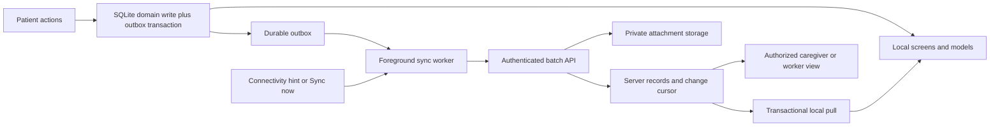

# MVP17 requirement-depth plan

Audit date: 2026-09-09. Worktree: **SMARAN-B** only. Branch: `feature/mvp17-requirement-depth`. HEAD and requested baseline: `cba3715`, `feat: overhaul Smaran AI accessibility navigation and UX`. Initial tree: clean.

This deliverable is documentation only. **CURRENTLY IMPLEMENTED** sections describe inspected source. Every design, field, route, rule, milestone and acceptance criterion under **PROPOSED / NEXT ARCHITECTURE** is future work. Names are proposed contracts, not existing APIs. Future migration numbers must be allocated after MVP16 is merged; none are created or reserved here.

The companion [SIH requirement matrix](SIH26003_REQUIREMENT_MATRIX.md) maps all 25 assessed aspects to implementation evidence, separate technical and medical/privacy risks, dependencies and tests. Its E01–E15 evidence references are used below.

## 1. Boundaries and baseline

### CURRENTLY IMPLEMENTED

The application is React Native 0.81.5, Expo SDK 54 (`~54.0.36` declared), React 19.1 and TypeScript with Expo Router. Native routes call services/repositories; SQLite is the local source of truth, Zustand holds UI/onboarding/pending-session state, SecureStore holds small values, and app-managed document files hold personal photos. There is no backend client or authenticated sync worker. `src/db/client.web.ts` deliberately rejects local persistence on web. A future worker web portal would need its own authenticated data path; it cannot reuse the current web client as a working database.

Important distinctions established by source review:

| Area | What exists | What must not be inferred |
| --- | --- | --- |
| Adaptation | `recommendDifficulty` uses bounded feature weights and a sigmoid; <0.35 suggests gentler, >0.75 suggests a challenge, otherwise hold; levels stay 1–5 and change at most one step. Optional easy/comfortable/challenging feedback updates weights locally. | No clinical model, diagnosis, severity or progression estimate. `sampleCount` counts training feedback updates, not all sessions. “Online trainer” is incremental local learning. |
| Sessions | `saveCognitiveResult` persists completed sessions through `saveCompletedSession`; schema requires all matching pairs/tasks completed. Pending results live in a Zustand store. | No durable session-start, abandonment, app-use or failure history. An absent completed row cannot establish a failed attempt. |
| My Care | Active local patient; today/last-7/previous-7 counts, three recent sessions, routine status, next appointment, memories and recent events. | No caregiver account, verified role, patient roster, permission grant, acknowledged alerts, full analytics or remote monitoring. Dashboard query is read-only, but its navigation opens patient activity/edit flows. |
| My Day | `myDayService.sync` reconciles local OS schedules against SQLite; reminders have revision and deletion fields. | Not network synchronization. Local notification delivery is not proof of receipt, medicine ingestion or appointment attendance. |
| Localization | Seven typed UI catalogs; four English regional items per state and 32 credited JPEGs; Routine Recall has English bodies and disclosure. | No seven-language regional stories or guaranteed seven-language offline voices. No cultural audio pack. |
| Security | SecureStore for active/onboarding flags, appearance and patient-scoped DOB; parameterized SQL; patient predicates; managed photo paths; limited permissions. | SecureStore does not encrypt the SQLite database or photos. The declared `authToken` key is unused; it does not implement authentication. |
| Build/QA | `eas.json` has a preview APK profile; MVP14 records a user-reported APK build/install. MVP15 records browser QA using temporary adapters. | No current-baseline physical Android PASS, merged APK permission inspection or current live-data audit was performed in this task. |

`docs/product/PRD.md`, `docs/architecture/TECHSTACK.md` and `docs/history/TODO.md` mix product intentions with future architecture, including Supabase, queueing and additional activities. Source/routes/schema take precedence when judging present coverage. Leave those shared documents untouched during concurrent MVP16 work; reconcile them in a later explicitly scoped documentation change.

### Safety contract for every future milestone

Smaran must never diagnose dementia; estimate stage or severity; predict clinical progression; prescribe medication; claim treatment, cure or slowed decline; replace clinicians; or fabricate a clinical risk score. Preserve the current non-clinical wording in UI, read-aloud, exports and all seven catalogs. Do not feed age/DOB, reminder completion, regional preference, inactivity or inferred condition into game difficulty. Use observed same-game performance and optional activity feedback only.

Use “recorded in Smaran,” “completed activity,” “recommended game level,” and “no completion recorded.” Avoid “non-adherent,” “deteriorating,” “high-risk,” “dementia score,” “memory age,” or any disease trajectory. Empty or stale data is uncertainty, not evidence of patient condition. Voluntary skipping must remain acceptable.

## 2. Caregiver alert system

### CURRENTLY IMPLEMENTED

E05/E06 supply reminders, Done events, upcoming times, session facts and memory timestamps. No alert table, rule evaluator, acknowledgement or caregiver delivery channel exists. `upcoming` excludes past one-time reminders and advances past daily reminders to tomorrow; it must **not** be the source for overdue detection. `today()` shows only today's enabled schedule. Historical reminder events do not snapshot original title/category; edited current text cannot safely be presented as historical text.

### PROPOSED / NEXT ARCHITECTURE

Ship a local factual inbox first. Reuse My Day repositories/date helpers and the caregiver service; add one alert service and one repository, not an event bus or generic rules platform. Evaluate on app foreground, entry/refresh of My Care, and after relevant successful writes. A failed alert refresh must not undo a successful reminder/session save. Reconcile on the next foreground so a crash between a domain commit and refresh is recoverable.

#### Data model and occurrence semantics

| Proposed record | Minimum fields and constraints | Purpose |
| --- | --- | --- |
| `reminder_occurrences` | `id` (stable opaque ID), `patient_id`, `reminder_id`, `local_day`, `time_of_day`, `time_zone`, `due_at` (UTC), `reminder_revision`, minimal `type`/title snapshot, `created_at`, `superseded_at`; unique `(patient_id, reminder_id, local_day)` for the existing one-per-day contract; patient/reminder ownership FK. | Preserves the due time/context actually evaluated; supports future factual schedule history. Materialize only from activation onward. |
| `caregiver_alerts` | `id`, `patient_id`, `kind` allow-list, `dedupe_key`, `source_id`, `source_revision`, `rule_version`, `observed_at`, optional `due_at`, `created_at`, minimal validated facts, `resolved_at`/`resolution_reason`; unique `(patient_id, dedupe_key)`, index `(patient_id, created_at, id)`. | Stores why an alert appeared, without a health-risk field or full duplicated medical notes. |
| `alert_receipts` | `alert_id`, `recipient_id`, `acknowledged_at`, `dismissed_at`; unique `(alert_id, recipient_id)`. Initially `recipient_id` denotes the shared local caregiver view, explicitly not an identified person. | Keeps acknowledgement/dismissal independent from the source condition; future recipients receive separate state. |
| `alert_preferences` | `patient_id`, enabled rule kinds, product timing thresholds, `enabled_at`, timezone policy, optional quiet hours. | Allows explicit activation/muting; prevents retrospective alert floods. Store settings as a small typed record, not executable expressions. |
| Optional later `patient_activity_observation` | One row per patient with `last_foreground_at`, device scope and observation source. | Supports “app opened on this device” only when intentionally instrumented; no background surveillance or screen-by-screen history. |

M3 requires an additive migration. Preserve migrations 001–006. Generate opaque IDs using the existing SQLite/random-UUID approach; none are credentials. Scope every query by patient and source. Do not use a local autoincrement event ID as a future cross-device identifier.

Default scheduling policy for future occurrences: use the explicitly recorded patient schedule timezone, initially the device timezone at activation. A timezone change prompts review before future reminders are reinterpreted; freeze already observed due instants. Existing code follows the current device timezone, so this change is a deliberate migration/UX decision with regression tests, not a silent reinterpretation of old data. Handle nonexistent/ambiguous local times explicitly and consistently with native scheduling; keep the chosen instant in the occurrence.

Current daily Done uniqueness is `(reminder_id, local_day)`, even after a same-day edit. Keep that behavior in the first alert milestone. Editing the time increments the reminder revision, supersedes old pending alerts and updates an unresolved occurrence, but never creates a second demand for Done that day. If an alert already exists, retain its minimal due-time snapshot; do not overwrite its historical facts. Disabled/deleted reminders resolve pending alerts; they do not erase receipts. Before generating an alert, read the current reminder, occurrence and completion in one transaction and recheck revision.

Do not reconstruct past “missed” occurrences from a reminder's present schedule. Generate today's occurrences and a bounded future window; preserve observed occurrences prospectively. A new installation/activation produces no historical overdue accusations. When returning after days away, show at most a grouped factual backlog for already materialized occurrences and an explicit gap for days never observed; do not produce hundreds of notifications.

#### Initial rule contracts

Timing values below are proposed configurable product defaults, **not clinical thresholds**. Caregivers can disable each rule.

| Kind | Evidence and trigger | Deduplication / resolution | Honest wording and delivery |
| --- | --- | --- | --- |
| Reminder overdue | Enabled occurrence due at least 30 minutes ago; no matching Done event; rule active when occurrence observed. Includes medicine/hydration/activity/custom, if enabled. | One alert per occurrence/rule version; keep a stable occurrence identity through same-day edits. Resolve on Done, disable, delete or superseding schedule. | “No completion recorded for the 09:00 reminder.” Never “medicine missed.” Local inbox first. |
| Appointment approaching | Enabled appointment occurrence in the next 24 hours, not completed, not past. | One per occurrence; expiry at due time or resolve on completion/reschedule. A later overdue entry is a separately named rule. | “Appointment listed for tomorrow at 10:00.” No attendance or transport guarantee. |
| No recent app activity | Only after foreground observation is added and explicitly enabled: elapsed 72 hours since last recorded opening on this patient device. | One per inactivity episode; reset only on a newly observed opening. Exclude deliberate pause periods. | “This device last recorded Smaran opening on [date].” Without that data, offer only “No completed activities recorded since [date]”; do not label it app inactivity. |
| Repeated unsuccessful sessions | **Disabled in initial M3.** Completed-only data cannot detect it. A later session-attempt record needs start ID, explicit end reason and optional linked completed-session ID. | If later enabled, one alert per factual episode, e.g. three explicit early exits in seven days in one game. Never classify process death, unsaved results or silence as failure. | “Three activities were ended before completion.” Alternatively show three recorded `challenging` feedback responses exactly as feedback, not unsuccessful sessions. |
| New activity available | Initially only a new personal memory or reviewed content version, with a stable source ID/version and explicit opt-in. Existing built-in games must not be advertised as newly added on every launch. | One per source/version; hide or resolve if source is removed. | “A new memory was added in Smaran.” No named contributor until authenticated provenance exists. |

Persist a local alert once and refresh its factual state idempotently. Receipts are separate dimensions: **acknowledge** means someone saw it; **dismiss** hides it for that recipient; **resolve** means the source condition ended or was superseded. None writes a reminder completion or changes adaptation. Do not reopen a dismissed occurrence on every evaluation. A new day's occurrence can produce a new alert. Show resolved history without alarm styling; cap inbox rendering and provide pagination.

Caregiver UX: a My Care “Updates” entry, factual count badge, Pending/Seen/History filters, due/observed timestamp, “Recorded on this device” label, source detail link, acknowledge and dismiss. Offer accessible text/icons; no red/yellow disease status or urgency ranking derived from game performance. Source links must recheck patient ownership and handle deleted records. A denied notification permission must leave the inbox fully usable.

Offline behavior: SQLite creation and receipts survive restart. Foreground evaluation is not guaranteed while the app is closed; planned appointment notifications can be scheduled ahead, but overdue/no-activity evaluation cannot promise exact-time background execution. Do not add a perpetual timer/service. Keep local OS delivery optional and use generic lock-screen text. Remote receipt, pushes and cross-device freshness wait for M7/M8; offline cannot notify a physically distant caregiver immediately.

Essential check: injected clock + in-memory SQLite exercise repeated evaluations, late/early Done, same-day time edits, tomorrow's recurrence, patient isolation, disabled/deleted reminders, death between source commit and evaluation, notification denial, dismissal persistence and timezone rollover. Later attempt telemetry must distinguish completion, explicit exit and interrupted/unknown. Never backfill invented attempts into old sessions.

## 3. Healthcare-worker monitoring

### CURRENTLY IMPLEMENTED

`app/onboarding/role.tsx` offers patient and caregiver entry, and the caregiver route resolves the same active local patient. No role/relationship schema, verified worker, patient roster or protected export exists. Patient-scoped SQL is useful isolation but does not authorize whoever supplied the patient ID. A `user_id` column with no identity integration is not an access-control system.

### PROPOSED / NEXT ARCHITECTURE

The smallest credible first step is **patient-initiated, supervised local review** on the patient's device. Entry clearly says “Show an activity summary to a healthcare worker.” It is a view mode, not a verified worker account. Offer overview, 7/30-day activity, game-wise history, recorded routines and listed appointments. Use factual template summaries and disclose local-only coverage. Do not build an EMR, clinical notes, diagnosis/staging forms, prescriptions, encounter billing or clinical decision support.

| Actor / mode | Read | Write | Authority boundary |
| --- | --- | --- | --- |
| Patient on own device | Own data as today | Existing own profile, reminders, memories and activities | Existing device access; no remote identity implied. |
| Local caregiver | Explicitly opened local My Care content | Alert receipts/preferences only within new access flow; existing patient editing is a separate patient-mode action | Shared device; local handoff is not verified identity. |
| Supervised worker review (M4) | Selected patient's selected date range: counts, sessions, routine completions and appointments | None to source records; explicit export request only | Patient/caregiver starts a short-lived review session; route cannot be opened by arbitrary `patientId`. |
| Remote caregiver (M8) | Only patients/categories granted by server membership | Own alert receipts; no remote reminder/medicine changes in first release | Authenticated account + active patient grant, checked server-side. |
| Remote healthcare worker (M8) | Assigned, consented patient summaries/history; photos/DOB/contacts excluded by default | No patient-domain writes | Verified assignment + expiring, revocable read grant. A self-selected role is insufficient. |

Reuse `caregiver.service.ts`, `careWindows`, domain repositories, `activityFacts`, `ScreenWrapper`, `SmaranCard`, `ThemedText` and `ReadScreenButton`. Separate read-only summary data from My Care's action links; do not copy the whole dashboard with its edit/game buttons. Proposed local routes: `app/review/index.tsx`, `app/review/history.tsx`, `app/review/export.tsx`; patient ID comes from a validated active review context, not URL authority. Exit returns to patient mode and clears the review state. Clear on background and after five minutes of inactivity; no review launch from deep link without an active handoff. Explain that someone controlling the unlocked device can still reopen patient mode; do not market this as strong separation.

First export is an on-screen preview plus explicit system text sharing using the installed React Native platform facility. Include selected period/timezone, generation time, pseudonymous/local patient label, completion counts, game-specific facts and “not a clinical assessment.” Exclude DOB, phone, reminder free-text notes and personal photos by default. A person can optionally include their preferred name in preview. Sharing discloses data to the selected recipient/app and cannot be recalled; disclose that at the action. Do not auto-email, auto-upload, save unencrypted reports broadly, or implement PDF/CSV machinery until requested. If CSV is later needed, escape cells and prevent formula interpretation.

M4 needs no clinical tables or domain migration if review context is in memory and exported text is ephemeral. Future remote role grants require server records: `accounts`, `patient_memberships(patient_id, account_id, role, scopes, expires_at, revoked_at, granted_by)`, consent records and minimal access/export audit events. Verify who may grant worker access and how delegation is established; a preference toggle cannot prove legal authority. Use a reviewed consent process appropriate to the deployment before real enrollment; this plan does not claim legal compliance.

Remote phase can reuse this app's read components through proposed `/caregiver/patients` and `/worker/patients/[id]` routes once data/auth boundaries exist. Do not begin a separate web portal merely for the SIH demo. Server authorization must gate every patient query, attachment and export; client route guards supplement it. Show dataset freshness and enforce revocation/expiry behavior described in M7/M8.

Acceptance: launch/exit and back/deep-link bypass attempts; no source mutations during review; denied/expired grants; wrong-patient requests; unknown/small history; export preview and canceled sharing; TalkBack and extra-large tablet/phone layout; device left idle or backgrounded during review.

## 4. Non-clinical cognitive analytics

### CURRENTLY IMPLEMENTED

E04 contains `difficulty`, timestamps, attempts, hints, average response time, accuracy, game-specific correct/repeated-error counts, feedback and recommended next level. My Care counts today, last seven calendar days and previous seven, but displays only three recent sessions. `getRecentSessions` permits at most 50 rows and uses `completed_at < before`; equal timestamps can be skipped between pages. These are limitations to address for full history, not reasons to duplicate storage.

### PROPOSED / NEXT ARCHITECTURE

Add bounded aggregate/history queries to the existing cognitive repository and one `analytics.service.ts` that returns typed factual summaries. No chart dependency, analytics warehouse, external telemetry service or derived-score table. Begin with readable numbers and a dated list; charts can follow if they improve comprehension and have text equivalents.

| Requested measure | Exact first-release definition | Limit / presentation |
| --- | --- | --- |
| Sessions completed | Count persisted rows with `is_demo_seed = 0`, patient, game and period filters | Counts saved completions, not starts or all real-world practice. |
| Game-wise accuracy | For each game and played difficulty: sum(matches or correct selections) / sum(attempts); show denominator | Do not average per-session percentages implicitly. No cross-game “cognitive accuracy.” No samples gives “No recorded sessions,” not zero performance. |
| Completion time | `completed_at - started_at`, presented as elapsed time | Includes wall-clock/background time; not active play time. Reject/flag nonfinite/negative values. |
| Decision response time | Stored `averageResponseMs`; aggregate weighted by attempts for the same game/difficulty | Existing resume logic resets decision boundary; it does not make elapsed session duration an active timer. Do not promise complete pre-background decision timing. |
| Hints used | Per session and sum for filtered game/period | Content/level changes affect comparability. |
| Mistakes | `attempts - matches` for Memory Match; `attempts - correctSelections` for selection games | Repeated mistakes/errors are a separately labelled subset, never additional errors to add twice. |
| Recommended difficulty | Latest saved recommendation for each game, with played level and source date | Never a single patient level or disease stage; old recommendations are dated, not recomputed silently. |
| Participation frequency | Number of local calendar days with at least one saved completion, out of 7 or 30 days | Explicit denominator and timezone; no guilt-inducing streaks. Unknown pre-enrollment coverage is disclosed. |
| 7-day / 30-day activity | Current local day plus previous 6/29 days, start inclusive/end exclusive; optional prior non-overlapping equal window | Use calendar arithmetic before converting query bounds to UTC; record display timezone. No clinical trend arrows. |
| Game-wise history | Stable keyset cursor `(completed_at, id)`, ordered by both descending; page size <=50 | Full-window aggregates use SQL over the selected window, not the latest 50-row list. |

Reuse `careWindows` calendar conventions and `activityTitleKeys`/`activityFacts`, with a defined 30-day extension. Pair aggregate reads within a consistent SQLite read transaction/snapshot where needed so counts/list headings agree during concurrent writes. Do not put writes inside an analytics read. A future exported report records the same filter, timezone and `asOf` time as the UI.

Routine analytics must say “marked Done in Smaran.” Existing events record completion time but not original titles/category or every scheduled opportunity; provide generic historical completions and label legacy context unknown. Do **not** calculate historical adherence percentages from today's reminder definitions. Prospective occurrence snapshots from M3 can later support “X of Y recorded scheduled items marked Done,” explicitly not medication adherence.

Suggested route: `app/caregiver/activity.tsx` with game/7-day/30-day filters and history. Use a small optional game/difficulty breakdown rather than a dense graph. Existing rows suffice: no migration for initial analytics. A new active-duration metric, session outcome, content variant or start telemetry would require a later explicit schema contract; do not infer missing values or backfill zero.

One focused host-SQLite check should cover two patients/all three games, seeded records excluded, >50 sessions, identical timestamps across pages, midnight/DST boundaries, empty windows, weighted accuracy, repeated-error subset, background-inflated elapsed duration and immutable before/after snapshots. On device, compare displayed values to a small set of deliberately played sessions, verify large-text scrolling and reading order, and confirm airplane-mode access.

## 5. Voice interaction

### CURRENTLY IMPLEMENTED

`speech.service.ts` selects a matching installed voice, stops earlier requests, speaks at rate 0.8 and returns started/unavailable/failed. `ReadScreenButton` cancels speech on focus/content changes and provides a visible failure fallback. There is no microphone recognition or command dispatcher. Bhashini always returns `available: false`. `app.json` explicitly blocks `RECORD_AUDIO`, and installed packages do not provide an STT integration. Finding a voice does not establish that it works offline; current code does not certify voice-pack network independence.

### PROPOSED / NEXT ARCHITECTURE

Separate recognition from intent handling: a device recognizer produces transient text; a small typed local allow-list maps reviewed phrases to six commands; the existing navigation/read functions execute them within the active patient context. This is not general conversational AI. Do not add an LLM, wake word, continuous microphone, medication command, destructive action, open URL, free-form tool execution or voice-triggered data sharing.

| Command | Action and safe boundary |
| --- | --- |
| “Open My Day” | Use existing primary-navigation behavior to open `/patient/my-day`; preserve Home/Back semantics. |
| “Start Memory Match” | Open the game's instruction/start screen; use its normal start transition when safe. Do not create a duplicate session or bypass instructions on an existing game. |
| “Read my reminders” | Read the current patient's actual loaded My Day summary; loading failure produces a retry message, not stale/fabricated reminders. |
| “Go Home” | Navigate through existing helper; if an activity is underway, preserve its normal exit confirmation/unsaved-work boundary before leaving. |
| “Read this screen” | Use a summary supplied by the focused screen, reusing Read Screen text; never scrape arbitrary hidden views or read a previous patient's screen. |
| “Stop” | Cancel recognition and/or stop TTS. It never means mark Done, delete, abandon a game or close the app. Always retain a touch Stop control. |

Push-to-talk uses visible idle/listening/processing states, a short timeout, cancel and an accessible prompt. Stop TTS before capture; ignore old/partial recognition callbacks using a request generation token, as the speech service already does. Match final results only after Unicode normalization, whitespace normalization and conservative language-aware case handling; use exact reviewed aliases. Unsupported/ambiguous text produces “Please try again or tap a button,” with no navigation. Show what action was understood. Validate focused route and current patient again at execution. Do not retain audio or transcripts in SQLite/logs.

Voice Stop is recognized only during an explicit listening session in the first release; it is not an always-listening interruption during TTS. The visible Stop button must work at all times. If hands-free interruption is later required, separately test echo/audio focus and privacy implications rather than silently enabling continuous capture.

#### Android/device STT choice

Prefer Android's on-device recognizer when the OS and selected language actually support it. API 31 adds `isOnDeviceRecognitionAvailable` and `createOnDeviceSpeechRecognizer`; API 33 adds recognition-support checks. The normal recognizer can use remote services, requires `RECORD_AUDIO`, uses main-thread lifecycle calls and must be destroyed when finished. Service discovery also needs the documented manifest query for relevant Android versions. These platform requirements do not guarantee a particular language/model. [Android SpeechRecognizer reference](https://developer.android.com/reference/android/speech/SpeechRecognizer.html), [API 31 changes](https://developer.android.com/sdk/api_diff/31/changes/android.speech.SpeechRecognizer).

`EXTRA_PREFER_OFFLINE` is only a recognizer-dependent preference; it is insufficient evidence for an offline promise. [Android RecognizerIntent reference](https://developer.android.com/reference/android/speech/RecognizerIntent.html#EXTRA_PREFER_OFFLINE).

A short device spike must establish capability for each language before choosing the smallest maintained Expo-54-compatible bridge or small native module. No such dependency exists today; this plan chooses the native capability, not an unverified package/API. Recheck its current contract at implementation. M6 requires deliberately removing the microphone block, declaring/requesting the permission when the user taps the control, explaining capture purpose and inspecting the merged manifest. It needs a rebuilt native development/standalone app; a JS-only change is insufficient. No permissions/dependencies change in this audit.

On devices without verified offline STT, keep the six equivalent large touch actions and existing TTS. Never silently switch an “offline” interaction to the network. Record a test matrix for **en, hi, as, bn, mni, kha, lus**: Android version/device, selected locale/script, recognizer provider, installed model, online/offline recognition, TTS availability and native-speaker command comprehension. Unknown capability remains unknown; seven UI catalogs do not guarantee seven STT models. Meitei script aliases require review; regional language must not be inferred solely from state.

#### Optional Bhashini enhancement

Only after an offline-capable touch path ships: explicit online-speech opt-in → brief audio request → authenticated application server proxy → selected Bhashini ASR pipeline → transient transcript → the **same local allow-list**. No provider credentials in the APK, no transcript-driven arbitrary actions, and no automatic transmission of patient profile/photos/reminder content. Configure strict payload/time limits, timeouts, cancellation and deletion of temporary audio; a server/provider outage returns to touch/TTS. Bhashini documentation describes pipeline discovery/configuration and compute calls; actual language/model availability and deployment terms must be verified for each chosen pipeline, not inferred from a platform marketing language count. [Bhashini API overview](https://bhashini.gitbook.io/bhashini-apis), [pipeline configuration](https://bhashini.gitbook.io/bhashini-apis/pipeline-config-call/request-payload).

Acceptance: permission denied/permanently denied/revoked mid-session; missing recognizer/locale/model; no network/model installed versus absent; background/call interruptions; double taps; stale callback after route change; no match/noisy room; wrong-language phrase; TTS echo; TalkBack focus/audio competition; all six actions with touch fallback. Test that a phrase about medicine cannot complete/edit a reminder and no raw speech reaches logs or storage.

## 6. Offline synchronization

### CURRENTLY IMPLEMENTED

Native local persistence works by architecture, but synchronization is missing. No outbox/change table, account/token lifecycle, connectivity detector, cloud schema, transport, server authorization or conflict resolver exists (E11/E12). The local SQLite database itself was not opened in this audit; findings concern schema and code.

### PROPOSED / NEXT ARCHITECTURE

Keep SQLite as the source of truth for local reads and offline writes. Introduce one transactional queue and one authenticated push/pull worker. For the first remote scope, one designated patient device writes patient-domain data; caregivers/workers read and write only their own receipts. This reduces conflict exposure without pretending it eliminates retries, stale writers or device replacement.



#### Existing entity inventory and changes

| Entity | Existing identity/version/delete behavior | Minimum future sync contract |
| --- | --- | --- |
| Patient profile/settings | UUID-style IDs from native crypto/SQLite fallback; timestamps; no server version/tombstone; optional unused `user_id` | Preserve IDs. Bind explicitly to enrolled account/patient membership. Add server revision metadata; keep appearance/active flags device-local. Do not upload DOB/contact by default. |
| Cognitive sessions | UUID-style IDs generated inside each save, immutable by public repository after save; real/demo flag; completed timestamps | Generate a durable completion/session ID before a retriable save so a lost response cannot create a second session. Replicate non-demo completed facts by ID. Protect immutable server payloads against conflicting reuse. |
| Adaptive model | Composite patient/game key; mutable feedback-updated weights; local timestamps | Keep model state device-local in M7, not a blindly merged blob. Remote views use saved per-game recommendations. Device replacement needs a declared reset or deterministic reviewed replay, not merged weights. |
| Reminders | 32-hex IDs, local `revision`, notification revision/ID, `deleted_at` | Preserve IDs/tombstones; add separate server revision. Never sync native notification IDs/revisions. Remote changes must reconcile through My Day scheduling after local commit. |
| Reminder completions | Local autoincrement integer ID; append-only triggers; unique reminder/day; `scheduled_for` is local wall time without zone | Add a sync-ID mapping table keyed to existing local event ID; backfill once transactionally. Preserve original event rows/triggers. Server dedupes by stable sync ID and `(patient, reminder, local_day)`. Add timezone/occurrence context prospectively; label legacy zone unknown. |
| Personal memories | 32-hex IDs and timestamps; hard deletion; relative local photo paths | Record deletion tombstone/outbox in the same transaction as removal; add server revision. Replace wire photo path with a separate attachment ID; retain local relative path on device. |
| Alerts/receipts/occurrences (M3) | Proposed stable IDs and observation timestamps | Sync minimal facts with source/occurrence dedupe; each authenticated recipient owns its receipt. Never attribute historical shared-local receipts to a remote named person. |
| SecureStore values | Local active/onboarding/appearance flags; patient-scoped DOB; no actual auth session | Exclude flags from payloads. Future credentials stay in SecureStore. DOB remains excluded unless separately authorized with a recovery/privacy design. |

Do not rekey existing patients by name/phone or treat installation ID as identity. Generate random installation IDs without hardware/advertising identifiers. Pairing needs an authenticated, explicit patient grant (e.g. a short-lived single-use invitation redeemed by an authenticated recipient); possession of a raw patient ID never grants access. First enrollment performs a transactionally snapshotted, resumable backfill of selected existing entities while ongoing changes enter the outbox; records and their initial operations must have stable IDs so restart cannot duplicate them.

#### Durable queue and wire contract

Proposed outbox fields: `operation_id` primary key, `patient_id`, `entity_type` allow-list, `entity_id`, `operation` (upsert/delete/append), `base_server_version`, immutable validated payload, `created_at`, `attempt_count`, `next_attempt_at`, `state` (pending/in_flight/blocked), optional lease expiry and sanitized last error code. Index due pending work. Store cursor/device/schema metadata separately, including a monotonic server change cursor; device wall-clock timestamps are informational, never the sole conflict ordering.

Every relevant repository write and queue insert share **one exclusive SQLite transaction**. Do not commit locally and later “best effort” enqueue. My Day/media services remain orchestration boundaries for OS/file work outside the SQL transaction. Do not hold a transaction open over network requests. Start with ordered operations and no queue compaction; future compaction may merge only unsent edits of the same mutable entity, never in-flight records or completion events.

Proposed authenticated request: protocol/schema version, enrolled device ID, bounded batch of operations, last pull cursor. Proposed response: result **per operation** (`accepted`, `duplicate`, `conflict`, `invalid`, `forbidden`, `retry_later`), accepted server version, bounded change page and next cursor. Treat these as design names until the backend contract is implemented. Server validation enforces ownership, permissions, field sizes/types, allowed game types and immutable fields; never trusts client role/patient/creator assertions. A dedupe record and domain write commit atomically server-side.

Worker procedure:

1. Run on foreground/start, explicit Sync now and a connectivity-restored hint; use a single-flight worker with a bounded lease. A foreground retry or lightweight future connectivity subscription is enough initially; evaluate an SDK-compatible connectivity package at M7, not now. Connectivity is a hint, not proof the server is reachable.
2. Obtain an authenticated session; retry expired access credentials through a single refresh path. If refresh fails, pause remote operations with a clear sign-in state while retaining local functionality and queue data.
3. Send small bounded batches, initially at most 50 operations with a total byte cap; honor source dependencies such as parent patient/reminder before child events. Skip attachments until their separate transfer prerequisites hold.
4. Apply individual accepted/duplicate acknowledgements transactionally. On lost ACK, resend **the same operation IDs and payloads**. Idempotency retention must cover offline replay; immutable entity/natural-key dedupe continues after any request-cache expiry. Do not mark an entire batch successful when one operation succeeds.
5. Retry transient timeouts/network/server errors with exponential backoff and jitter, e.g. 5 seconds rising to a 15-minute cap; honor server retry hints. Persist schedule across restart; allow explicit retry after correction. Validation/permission conflicts become visible blocked items, not infinite retry loops or silent deletion.
6. Pull authorized changes in cursor order. Apply a complete page and advance its cursor in one transaction; do not overwrite local pending edits. A malformed/dependent item prevents advancement past unprocessed data unless the protocol has an explicit durable quarantine/ack mechanism. M7 uses simple page retry with visible blocked status. Ignore echoed applied operation IDs to avoid enqueue loops.
7. After commit, reconcile affected local notifications and attachments through existing services. A native scheduling failure does not roll back downloaded records; mark delivery unavailable and retry separately. Report pending/blocked counts and last successful sync/last patient-device upload time separately.

#### Conflict rules

| Conflict | Required behavior |
| --- | --- |
| Same session/operation resent | Return the original accepted result; do not duplicate session or train a model again. Same ID with different payload is a conflict/error, not an overwrite. |
| Same reminder/day completed on two devices | Preserve completion as a set membership. Deduplicate while retaining factual source metadata; do not create a second reminder or infer two doses. |
| Concurrent reminder edit | Compare `base_server_version`; stale writer is rejected to a visible review state with both versions preserved. No last-client-clock-wins for medicine/time changes. Keep the locally chosen schedule visible with a sync-conflict warning until resolved. |
| Delete versus delayed update | Tombstone wins for the same entity generation; a delayed update cannot resurrect it. Preserve unsent local content as a conflict draft if needed. Explicit recreation gets a new ID. |
| Profile/memory text edits | Same optimistic version check; offer explicit choice of the preserved versions. Single primary writer makes this uncommon, but device handover still needs the rule. Never silently discard a longer note/photo. |
| Reminder Done versus time edit | Follow one completion per local day from M3; do not demand a second Done because of the edit. Preserve original occurrence context; do not imply adherence to a new schedule. |
| Multiple recipients acknowledge | Receipts are per recipient; acknowledgement is monotonic. A remote named receipt is distinct from local shared-view receipt. Source resolution never falsifies acknowledgement. |
| Clock skew / timezone change | Order by server revisions/cursor; display observed and received times separately. Store chosen occurrence timezone/UTC instant. Flag future/skewed observations; never use them to manufacture inactivity alerts. |
| Old app / new schema | Version handshake rejects unsupported writes visibly; keep local data/queue intact. Do not down-convert unknown game types or drop fields. |
| Primary device handover | Revoke old writer enrollment online before activating a new writer. An old offline device may continue local use, but its later writes are held for explicit review if authority/version is stale. Do not merge two adaptive models or lose old local data. |

Tombstone retention must outlast permitted offline replay. Initial rule: retain compact tombstones while any enrolled device may replay; either retain them until device retirement or require a full reconciliation after a server-declared expired cursor. Document the cutoff and preserve pending local writes during rebase. A simple 30-day purge with unlimited offline devices is unsafe. Account/patient erasure is a separate explicit privacy workflow, not an ordinary sync tombstone cleanup.

#### Photos and partial failures

Use private attachment IDs scoped to patient ownership; never send `file://` URIs or raw relative paths as remote access URLs. At opt-in upload: revalidate MIME/bytes and dimensions, strip embedded metadata with a verified transform, impose size limits, and use content hash/integrity checks. `exif: false` in the current picker suppresses returned metadata; it does not prove the copied image has no embedded metadata.

Transfer order: stage an authorized attachment record → upload to a temporary private object → verify integrity → mark ready → link a versioned memory record. Keep old local/remote working photo until replacement is accepted. Failed upload leaves local memory usable with “Photo waiting to sync.” Metadata-only sync can succeed while photo transfer retries. Download to a temporary managed file, verify, then atomically promote and update SQLite; never render a partial file. Use Wi-Fi preference/manual pause for large photos, bounded retries and orphan cleanup after a documented grace period. Consent must cover family photos; default worker access excludes them. Bundled regional assets travel in the app, not as patient uploads.

Airplane-mode acceptance: create/edit/complete/play/add photo/delete, kill/reopen, inspect pending state, reconnect and verify two-device convergence. Inject disconnection after server commit but before ACK, parent-only batch success, attachment-only failure, revoked access, expired token, low storage, clock skew, duplicate Done, stale edit/delete and cursor expiry. Verify no source-data loss, duplicate events, accidental reminder rescheduling or cross-patient access. Remote pages must say “Last received…” and “Device last synced…”; **no new upload is not proof of no app activity**.

## 7. Security and privacy hardening

### CURRENTLY IMPLEMENTED audit and PROPOSED actions

| Boundary | Observed evidence | Next action and residual risk |
| --- | --- | --- |
| SecureStore | Wrapper gates availability; writes fail explicitly, reads return null when unavailable. DOB keys are patient-scoped; no authentication option is requested. | Preserve protected storage for secrets. Distinguish unavailable/corrupt/missing values in recovery UX. Do not clear patient data to “fix” flags. No token is actually issued today. |
| SQLite | Names, age bracket, emergency contacts, settings, reminders/notes, game telemetry/model, memory names/relationships/descriptions and photo paths; WAL/FK and parameter binding. No SQLCipher/key configuration. | Treat as sensitive app-sandbox data, not app-encrypted data. Minimize collection and exposure. Assess threat model before enabling database encryption; design key-loss/recovery and encrypted upgrade first. Never merely turn on a build flag against an existing plain database. |
| Managed files | Photos copied from validated picker cache to `Paths.document/memories/{patientId}`; size cap 20 MiB, relative path validation, staged replacement/cleanup. | Keep sandbox boundaries, test missing files/cleanup failures, and strip metadata before export/upload. Current files are not app-encrypted, and failed cleanup can leave sensitive orphans. |
| Backup/restore | No explicit app-wide `allowBackup`, backup XML or extraction-rules policy in tracked config/native files. SecureStore plugin is present. | M1 explicitly excludes sensitive databases (including associated WAL files), personal media and SecureStore from cloud backup/device transfer using version-appropriate generated rules; verify actual native paths and merged artifacts. Explain data-loss/recovery implications. Do not assume current device behavior from source alone. |
| Notifications | Current title/body are user-entered reminder title/note, plus reminder ID. | Default to generic private lock-screen text; show details only after opening patient context. Keep category/medicine names out of remote push payloads. Test Android channel/lock-screen behavior. |
| Permissions | CAMERA, RECORD_AUDIO, broad legacy storage, biometric/fingerprint and overlay permissions blocked; image picker has camera/microphone disabled; notifications requested contextually. | Keep least privilege. M6 microphone and any future device-auth integration require deliberate config changes and fresh native permission inspection. No camera/location/contacts permission needed for proposed activities. |
| Local caregiver separation | Role is onboarding/UI state; My Care can resolve an existing active patient from either entry path. No PIN/auth or persisted caregiver grant. | Clearly disclose shared-device access now. Add explicit consent/handoff and short-lived review state. If private caregiver-only notes/actions are later required, implement a verified device-auth gate at route and service boundaries; a hidden tab or selected role is insufficient. Do not add private notes in the initial design. |
| IDs and access | Mixed opaque UUID/hex IDs plus integer completion event IDs; SQL predicates scope patient. | Preserve validation, random IDs and FK constraints. IDs are identifiers, not passwords. Remote authorization must resolve authenticated membership for every entity, even when the caller supplies valid IDs. |
| Logs | Found console exceptions are development-gated, including bootstrap, routing, result, speech and error boundary. No production analytics export found. | Audit exception payloads before adding crash reporting; development logs can still contain real data. Allow-list operational codes/correlation IDs, not SQL parameters, transcripts, images, reminder notes or tokens. No secret contents were inspected in this audit. |
| DOB/profile save | DOB is separate SecureStore data; SQLite profile/settings writes can commit before the DOB/flags write. MVP15 documents recovery limits. | M1 test interruption between each write. Resume existing profile safely and allow a retry; do not fabricate DOB, auto-create duplicates or require wiping SQLite. A cross-store transaction is not currently available. |
| Deletion and retention | Memories hard-delete then clean media; reminder events prohibit update/delete with triggers; patient FKs include RESTRICT. No complete patient-erasure flow. | Specify a user-authorized erasure/retention policy before real deployment. Implement a dedicated, reviewed workflow across DB/media/SecureStore/server/backup when authorized; never disable triggers or cascade-delete ad hoc. Local reminders remain append-only in ordinary use. |
| Remote credentials/data | No remote auth, refresh, server or grants. | M7 adds TLS, server-side least privilege, consent scopes, token lifecycle, logout/revoke, private objects and bounded logs. Service credentials stay server-side. Remote worker cache is absent initially; add encrypted expiring offline cache only if field workflow requires it. |

Expo's SecureStore plugin normally excludes its own preferences from Android backup; it does not set a whole-patient-data policy. Custom backup configuration must retain the SecureStore exclusion. Restored ciphertext may be unusable after Android key removal. [Expo SDK 54 SecureStore](https://docs.expo.dev/versions/v54.0.0/sdk/securestore/).

Android backup commonly includes app files/databases by default, and `allowBackup=false` alone may not disable device-to-device transfer on some Android 12+ devices. Therefore generated rules and observed restore behavior must be verified, not merely a JSON field. [Android Auto Backup](https://developer.android.com/identity/data/autobackup).

Expo SDK 54 supports optional SQLCipher and defaults it off. Encryption is a separate migration/key-lifecycle project if required by the deployment threat model; it does not provide caregiver authorization or encrypt independent photo files. [Expo SDK 54 SQLite](https://docs.expo.dev/versions/v54.0.0/sdk/sqlite/).

Priorities: private notifications and clear device-sharing/backup/recovery boundaries before new sharing; consent/grants/auth before remote access; encryption decisions before remote offline caching or deployment requiring stronger at-rest protection. No legal/medical compliance certification is claimed. Deployment-specific legal obligations and authorized representative consent require qualified review; this document invents no statutory deadlines or mandated retention period.

## 8. NER localization, emotional engagement and activity depth

### CURRENTLY IMPLEMENTED

Seven catalogs are composed from the base/UX/My Day/memory/My Home/care/cognitive string files: en, hi, as, bn, mni, kha and lus. Type definitions and migration 003 include the same language set. `t()` has an English fallback; catalog parity is a structural check, not linguistic certification. Regional settings independently enumerate assam, arunachal, manipur, meghalaya, mizoram, nagaland, sikkim and tripura.

All eight states have exactly four content items and bundled JPEGs (32 total). `src/my-home/content.ts` stores English title, short description, detail, optional prompt and image description; `my-home-memory.tsx` marks English content and uses English speech explicitly. Surrounding controls, region names and categories are translated. `Routines` contains five English pretend activities, disclosed as English by the shared selection screen. Personal memory text is authored by users; it has no separate content-language tag, so reading mixed-language family text using the UI voice needs explicit review.

This is real culturally localized **subject matter and imagery**, alongside multilingual **UI**; it is not complete multilingual cultural content. `../product/NER_CONTENT_SOURCES.md` provides editorial references and the image-credit ledger includes rights/attribution records. Source-count/metadata inspection does not independently relicense every asset or certify community appropriateness. No bundled MP3/WAV/OGG/M4A cultural audio was found. Default notification sound/TTS are not culturally localized sound content.

### PROPOSED / NEXT ARCHITECTURE

#### M5a: translate and review the content already present

Keep stable content IDs, asset mapping and credits. Add typed localized body maps keyed by existing item/routine IDs. Each displayed body has an explicit resolved language; fallback displays a concise disclosure and sets read-aloud/accessibility language consistently. Do not synthesize “translations” at runtime or select a language automatically from a state.

Review queue: safety/consent/alert words first; routine instructions and object labels next; all 32 regional title/detail/prompt/image-description sets; then optional narration. Have native speakers review meaning, script/dialect, respectful adult tone, spoken commands, date/time understanding and task comprehension. Ask community reviewers whether the subjects feel familiar and appropriate; do not treat translated words as proof of familiarity. Review Assamese/Bengali distinctions, Meitei script needs and long Khasi/Mizo text on actual devices. Record reviewer, language/community, content version and unresolved wording in a small content-review ledger. No claim of all NER languages being served by seven catalogs; choose any additions from user/community evidence.

Begin a jury demonstration with fully reviewed content for selected pilot languages and clearly disclose remaining English fallback. Completion of seven-language body coverage remains a tracked requirement; do not silently reduce the intended language scope. A multilingual catalog update alone requires no DB migration. Persisting a memory content-language preference later would need a migration or explicitly designed metadata field; until then show/manual-select read language rather than guess.

#### M5b: one minimal attention/object module

Pattern Recognition meets geometric continuation and exercises attention incidentally. It does not ask users to recognize everyday objects, sustain target selection across distractors, or interpret different depictions of the same object. Memory Match identifies matching symbols, which is not equivalent to naming/selecting an object from a prompt.

Add **one** activity, “Find the familiar object,” with two content variants: match a visible target picture among 2–4 choices (attention), or select a reviewed object from its written/spoken name (object recognition). Keep it untimed, with optional hints, large distinct images, one valid answer and a skip/stop path. Use generic everyday objects first, then a small optional reviewed regional set. No camera, computer vision, identity recognition or extra game for each state. Whole cultural photos should remain browsing content unless an unambiguous, rights-compliant object crop works at small sizes.

Reuse `SelectionTask`, `createSelection`, `chooseSelection`, `hintSelection` and `finalizeSelection` semantics. Extract only the minimal image-choice rendering needed in the existing shared screen; avoid a generic game/plugin framework. A new `object_recognition` game type must extend every exhaustive switch/title map, repository validation, session metrics, model key and SQL CHECK coherently. Current `finalizeSelection` assumes only pattern/routine, so adding a route alone would misclassify results. Give this game its own per-patient model. Add content-variant/version metadata if both variants are stored, separate their analytics and personal pace baselines, and disclose old rows' unknown content version. Do not pool name-based and image-based difficulty as equivalent.

Prospective reviewed subject candidates, using existing regional packs as discussion references rather than presumed universal experience:

| State | Existing subject anchor | Small future activity / engagement candidate |
| --- | --- | --- |
| Assam | Tea gardens, silk, masks, Bihu | Find a cup/leaf in reviewed object cards; optional cloth or gathering prompt. |
| Arunachal Pradesh | Ziro fields, weaving, Tawang, Sela | Notice a simple textile pattern; optional field/path viewing, no claim of belonging to a named community. |
| Manipur | Longpi pottery, market, lake, dance | Select a clearly pictured pot/bowl; optional market-memory prompt. |
| Meghalaya | Weaving, bridges, lake, Wangala | Find a basket in reviewed cards; optional craft/lake viewing. Do not conflate Khasi and Garo traditions. |
| Mizoram | Puan, Cheraw, Reiek, Chapchar | Simple reviewed textile motifs; optional shared viewing, without testing cultural knowledge. |
| Nagaland | Shawl, morung, Hornbill, Dzukou | Choose a familiar everyday object beside an optional shawl subject; avoid tribal-identity quiz assumptions. |
| Sikkim | Carpet, tea, lake, Rumtek | Simple carpet-shape comparison; optional tea/lake prompt, no religious participation assumption. |
| Tripura | Bamboo, palaces, Hojagiri | Find a basket or simple crafted object; optional palace/craft viewing. |

These candidates require object-image/label/rights review; several would need additional suitable assets. They are not already implemented activities or claims of cultural coverage. Keep one curated small pack per pilot, stable choice IDs, randomized ordering with deterministic tests and no color-only distinctions. For a screen-reader user, labelled image selection exercises a different task; offer an equivalent accessible activity and keep its measurement interpretation explicit rather than claiming visual-recognition measurement.

#### Emotional and social participation

Reuse personal memory viewing and the regional detail prompt. Add an optional “Look together” action and a prompt such as “Would you like to tell someone about this picture?” with “Not today” and Stop equally available. A caregiver can help select a photo through the existing memory editor on the same device. Do not claim named-family contribution unless author identity is known. Offer a small rotating set of reviewed positive prompts; avoid reward streaks, shame, forced reminiscence, mood inference, loneliness reduction claims, conversational impersonation or therapeutic guarantees.

Initial shared viewing needs no social graph, chat, notification to relatives, mood score or participation database. If user testing later requires recording completion, store only an explicitly chosen optional activity event with a clear purpose/retention policy; never infer emotional state from a tap. Memory deletion/removal and easy return Home must remain available when a picture is upsetting. Remote family contributions wait for membership/photo-consent controls in M7/M8.

#### M5c: cultural sound/narration extension

Start with a handful of opt-in local recordings only after rights and native-speaker/community review; use transcripts and visible language/credit labels, tap-to-play/stop, no autoplay or sudden celebratory sounds. Keep family voice recordings out of the first scope: recording/upload/retention consent is a distinct feature. Audio playback is not currently installed as a dedicated capability; evaluate an SDK54-supported player at implementation, keep assets size-bounded, and coordinate any native configuration with M6. Bundled playback alone needs no microphone permission. This is a completion step for the sound requirement, not a reason to block text/visual improvements.

Acceptance for all M5 increments: seven-catalog placeholder/parity checks once dependencies exist; native-speaker comprehension sign-off; all eight saved-state mappings and clear language fallback; no accidental English speech over translated content; long strings/font/TalkBack; image rights/attribution and target clarity; every game level and feedback/model isolation; skip/stop/no-autoplay; airplane-mode media; deleted/missing personal photo; consent and distress-copy review without outcome promises.

## 9. Milestone roadmap and implementation boundaries

### PROPOSED / NEXT ARCHITECTURE

**Integration gate:** wait for SMARAN-A's MVP16 product hardening to merge before modifying shared production surfaces. Re-read the actual merged diff and rerun baseline checks; this audit does not predict its final code or migration count. No merge is performed here. Future filenames below are minimal likely additions, not a mandate to scaffold every file. Extend current feature files where that is clearer.

| Milestone | Objective / why SIH needs it | User-visible deliverable | Prerequisites | Complexity |
| --- | --- | --- | --- | --- |
| M1 Privacy, recovery and device acceptance | Strengthen secure-data and elderly-use foundations before wider exposure | Private reminder notifications, honest local-sharing/backup messaging, tested interrupted-save recovery | MVP16 integrated; device test access | Medium; encryption conversion, if required, is a separate High scope |
| M2 Factual activity analytics | Expand tracking beyond recent cards | 7/30-day per-game counts, metrics and complete paginated history | Agreed metric semantics; integrate after M1 | Medium |
| M3 Local caregiver updates | Deliver the missing caregiver-alert lifecycle | Factual overdue/approaching/new-content inbox, acknowledgement/dismissal, freshness and opt-outs | M1; M2 semantics; prospective occurrence policy | High |
| M4 Supervised healthcare-worker review | Deliver a credible small worker workflow | Read-only selected summary/history/appointments and explicit text export | M1/M2; M3 only for prospective routine denominator/history | Medium |
| M5 NER and engagement depth | Close body-language, object/attention and sound gaps | Reviewed localized bodies, shared viewing, one object activity; optional small sound pack | Reviewers/rights; M1 baseline; M2 definitions for new game | Medium for text/viewing; High including game/schema/audio |
| M6 Bounded voice commands | Add voice input while retaining offline independence | Six push-to-talk commands where device supports them; complete touch fallback | M1; command-language review from M5; device spike | High; universal offline seven-language ASR is unproven and outside the promise |
| M7 Authenticated offline synchronization | Meet remote-area synchronization, not just persistence | Opt-in pairing, durable queue, Sync now/status, secure metadata/photo replication | M1, M2/M3 contracts; server identity/storage decisions | Very High |
| M8 Remote caregiver/worker monitoring | Finish remote monitoring and caregiver delivery | Granted patient lists, factual remote summaries, recipient receipts and generic pushes | M7 convergence + authorization acceptance; M4 view contracts | High |

### M1 implementation card

- **Architecture/reuse:** retain SecureStore, SQLite, My Day reconciliation, managed photos, active-patient resolution and existing recovery UI. Add only the local privacy/review-context logic needed; no custom cryptography.
- **Likely files:** `src/services/privacy.service.ts` only if shared logic is needed; `plugins/with-private-backup.js` if native XML generation needs a local plugin; future privacy/acceptance documentation. Existing `app.json`, settings/support, `my-day.service.ts` and onboarding/profile save paths may change.
- **DB/migration:** none for notification privacy and messaging; any erasure mechanism or encrypted conversion needs a separate approved data migration/recovery plan, never changes to 001–006. DB and SecureStore failure recovery must preserve existing records.
- **Android permissions:** none added in the initial scope. A future strong local authentication gate requires an explicit platform permission/package decision because biometric permissions are blocked today.
- **Offline/security:** full local operation; no cloud backup advertised. Explain loss/reinstall limits; verify generated exclusions and data survival/recovery without collecting more personal data.
- **Regression/device tests:** killed onboarding between writes, SecureStore unavailable versus missing, reminders after privacy-content reschedule, force-stop/reboot, denied notifications, lock-screen contents, backup/device-transfer/restore on a disposable test profile, TalkBack and keyboard/Back. Do not test erasure on real data.

### M2 implementation card

- **Architecture/reuse:** SQL aggregates and stable history cursor in `cognitive.repository.ts`; calendar windows from `caregiver.service.ts`; `activityFacts`, cards, typography and read-aloud.
- **Likely files:** `src/services/analytics.service.ts`, `app/caregiver/activity.tsx`, `scripts/check-analytics.cjs`; extend care strings and caregiver entry.
- **DB/migration:** existing columns/indexes suffice; no migration initially. Queries must aggregate the whole selected period, not the recent-row cap.
- **Android permissions:** none. **Offline/security:** all queries local and patient-scoped; no upload. Protect entry consistently with M1's stated shared-device boundary.
- **Regression/device tests:** formula/page/date tests from section 4; recheck existing My Care counts and game result/Why flows; phone/tablet, extra-large text and spoken numbers. Read-only snapshot must remain unchanged.

### M3 implementation card

- **Architecture/reuse:** add a pure factual-rule evaluator and transactional alert/occurrence repository behind `caregiver-alert.service.ts`; reuse My Day source data and notification handling. Do not add background surveillance.
- **Likely files:** `src/services/caregiver-alert.service.ts`, `src/db/repositories/caregiver-alert.repository.ts`, `src/caregiver/alert-rules.ts`, `app/caregiver/alerts.tsx`, one future additive migration and `scripts/check-caregiver-alerts.cjs`.
- **DB/migration:** required for occurrences, alerts, receipts and preferences. Optional activity observation is a subsequent small extension; unsuccessful-session rules remain disabled until explicit attempt telemetry exists. Allocate migration version after MVP16.
- **Android permissions:** none for inbox; reuse notification permission only if local alert delivery enabled. No exact-alarm/background-service permission assumed.
- **Offline/security:** durable local inbox; restricted factual snapshots; no guaranteed app-closed evaluation. Generic notifications; opt-outs and patient scoping.
- **Regression/device tests:** section 2 occurrence/race cases; rapid My Day edits; process death, clock/timezone changes, permission denial, source deletion, acknowledgement that leaves Done untouched, accessible pending/history lists.

### M4 implementation card

- **Architecture/reuse:** supervised in-memory review context + read-only service built from M2 and existing caregiver/reminder repositories. Reuse UI components, not editable dashboard navigation.
- **Likely files:** `src/services/review.service.ts`, `app/review/index.tsx`, `app/review/history.tsx`, `app/review/export.tsx` if a separate preview route is useful, `scripts/check-review.cjs`.
- **DB/migration:** none for local preview/text sharing; history snapshots come from M3, with older rows labelled unknown. Remote grants/audit belong to M7/M8.
- **Android permissions:** none for system text sharing. **Offline/security:** local view and preview work offline; the chosen external sharing target controls delivery. Default redaction, expiry/background clear, no worker identity claim.
- **Regression/device tests:** read-only DB diff, direct/deep-link entry without handoff, Back/timeout/background, patient switch, no edits, exported date/scope parity, cancel sharing, large-text/tablet and TalkBack.

### M5 implementation card

- **Architecture/reuse:** M5a typed body translations over stable regional/routine IDs; shared memory viewing and optional prompts; M5b one selection-based object game; M5c tiny reviewed audio pack. Reuse content credits, region selection, shared activity rendering/selection engine, adaptation and result screens.
- **Likely files:** `src/my-home/localized-content.ts`, `src/games/routine-content.ts`, `src/games/object-recognition.ts`, `app/patient/games/object-recognition.tsx`, a small content-review ledger, game check and optional sound manifest. Extend existing title maps/types/SQL validators explicitly rather than adding a parallel model.
- **DB/migration:** none for translated bundled text/shared viewing. **Required** for a persisted new game type and any content-variant/version metric. Audio assets alone require no DB; family recording metadata remains deferred.
- **Android permissions:** no camera/microphone for object cards/bundled playback. A player dependency/native rebuild may be needed only for M5c; select after checking SDK54 docs.
- **Offline/security:** bundled text/assets; patient-choice/skip and no mood scoring. Personal photos remain local unless later explicitly shared; credit/rights review for any derivative image/audio.
- **Regression/device tests:** section 8 cases plus all existing game/session/migration tests, legacy database upgrade, variant-separated analytics, image label ambiguity, small-screen choices, languages/scripts, audio stop/interruption and airplane-mode startup.

### M6 implementation card

- **Architecture/reuse:** native capability wrapper → local phrase map → guarded existing navigation/read action. Reuse `speech.service.ts` cancellation semantics, `ReadScreenButton`, patient-navigation helper and touch controls.
- **Likely files:** `src/services/voice-command.service.ts`, `src/voice/commands.ts`, `components/accessibility/voice-command-button.tsx`, a small Android bridge/config plugin only after capability selection, `scripts/check-voice-commands.cjs`.
- **DB/migration:** none for transient recognition; explicit device opt-in can use existing secure preference pattern. No audio/transcript tables.
- **Android permissions:** microphone required, remove present block deliberately, runtime prompt, service query and native rebuild; no background recording. Verify each chosen integration's exact native requirements.
- **Offline/security:** only advertise offline speech on verified locale/device models; otherwise keep touch/TTS. Optional Bhashini proxy is a later online addition, not a core dependency.
- **Regression/device tests:** section 5 capability/permission/noise/race tests; commands while editing/playing, Home stack duplication, Stop versus app exit, TalkBack/voice overlap, seven-language alias review. Basic unsupported-device fallback must pass before expanding languages.

### M7 implementation card

- **Architecture/reuse:** one relational backend with managed identity and private object storage, one authenticated batch API, one local outbox worker. Supabase is a candidate from existing planning docs, not an installed/chosen implementation. Select a provider once; avoid microservices and custom auth cryptography. Reuse repositories, ID validation, exclusive transactions, SecureStore and media/schedule orchestration.
- **Likely files:** `src/db/repositories/sync.repository.ts`, `src/services/sync.service.ts`, `src/services/auth.service.ts`, `src/sync/types.ts`, `app/patient/sync.tsx`, future migrations, a minimal `server/` or chosen provider's conventional directory, and `scripts/check-sync.cjs`. Backend contract/permission integration tests accompany it.
- **DB/migration:** required for outbox, cursor/device metadata, server revisions, completion sync-ID mapping, memory deletion representation and enrollment/consent metadata. Future server schema/grants and private object policy also required. Snapshot/backfill must preserve populated 001–006 data and newer M3/M5 records.
- **Android permissions:** no new dangerous permission for metadata sync; inspect networking/connectivity manifest needs. Photo selection keeps existing picker. No permanent background service requirement.
- **Offline/security:** local data remains available when auth/network fails; remote writes pause. Server ownership validation, stable operation IDs, tombstones, explicit consent, bounded payloads, private attachments and no service credentials in app.
- **Regression/device tests:** section 6 two-device/airplane-mode failure matrix, server permissions, upgrade/rollback/queue recovery, retries without retraining, photo replace/delete races, local reminder scheduling after pull, old-version clients and clock changes.

### M8 implementation card

- **Architecture/reuse:** M4 view models and M2 facts over an authenticated remote repository; server grants/receipt API from M7. Server derives remote updates only from accepted versioned facts. A small scheduled server evaluator can handle approaching reminders; label freshness and avoid inferring offline activity. Push is a hint to fetch authorized inbox state, never the source of truth.
- **Likely files:** `app/caregiver/patients.tsx`, `app/worker/patients/index.tsx`, `app/worker/patients/[id].tsx`, `src/services/remote-care.service.ts`, provider-conventional grant/push handlers and authorization integration tests. Reuse alert UI instead of duplicating its rules per screen.
- **DB/migration:** server memberships, recipient receipts, consent/revocation/audit and device push registration; local recipient preferences as needed. Remote worker patient records are not persistently cached initially, so no new patient-data mirror is required on worker devices.
- **Android permissions:** notifications only for opted-in remote recipients; no location/contact access. **Offline:** patient app remains independent. Remote readers display a connection/unavailable state after losing connectivity; if holding a currently authorized in-memory view, show it as stale, clear on background/logout/expiry, and disable live-status claims.
- **Security:** patient grants per role/category, expiring worker assignments, default photo/DOB exclusion, generic push, online authorization on every request. Revocation removes server access immediately; delivered exports cannot be recalled. Do not imply offline revocation can instantly erase an already viewed screen. No persistent worker offline cache until encryption/expiry/revocation policy is separately designed.
- **Regression/device tests:** two authenticated roles/two patients, request-ID tampering, consent revocation, stale grant/clock, logout/switch-user cache clearing, push denied/duplicated/tapped after revoke, offline patient delay and no-activity wording, list/detail Back and tablet accessibility.

### Independent work and safest critical path

Before MVP16 integration, useful independent work is limited to documentation/contracts, external device capability research, reviewer recruitment and content/rights review. Do not pre-empt shared production files.

After integration: M2's pure aggregate semantics, M5a content review/maps and M6's device-capability spike can progress independently with file ownership. M3 consumes M2's definitions but does not depend on the analytics screen. M4 can use current generic routine history without M3; it depends on M3 only for prospective schedule denominators. M5 text/shared-viewing needs neither sync nor worker roles. M7 protocol/auth planning can run alongside local milestones, but schema integration must incorporate final M3/M5 types, and M8 cannot ship before M7 authorization/convergence.

Recommended visible order remains **M1 → M2 → M3 → M4 → M5 → M6 → M7 → M8**. If time is constrained, demonstrate M1–M5 honestly as local capabilities and label voice/sync/remote as pending. Do not replace working airplane-mode behavior with a cloud-dependent demo. The full SIH gap list remains open until its remote and cultural-audio requirements are implemented and tested.

## 10. Parallel-development safety with SMARAN-A

SMARAN-A is reported to be doing MVP16 product hardening. Its worktree, branch or live diff was **not inspected**, consistent with working only in SMARAN-B. The risks below are predicted from this baseline's integration points, not claims about A's actual edits.

| Surface | Likely overlap | Safe future integration approach |
| --- | --- | --- |
| `app/_layout.tsx` | Bootstrap, recovery, global navigation; future sync/voice/auth lifecycle hooks | Wait for MVP16. Prefer feature-scoped hooks, add a root hook only when lifecycle requires it; one owner resolves final bootstrap ordering. |
| Navigation | `components/patient/patient-navigation.tsx`, `src/utils/patient-navigation.ts`, `app/patient/_layout.tsx`, menu/Home/caregiver routes; worker/alert/voice entries | Wait for merged route contract; preserve exact browsing-route visibility and Home/Back semantics. Review hardware Back, deep links and unsaved game exits. |
| Theme/colors | `constants/colors.ts`, `constants/theme.ts`, `hooks/use-theme-color.ts`, appearance store | Reuse tokens without palette changes. Do not mix feature work with theme redesign; accept MVP16's final shared API. |
| Shared components | Screen wrapper, cards/buttons/fields, typography, Read Screen, selection activity screen | Keep new behavior feature-local until final integration; avoid copied parallel components. QA focus/loading/reduced-motion contracts after merge. |
| i18n | `src/i18n/strings.ts`, regional and feature catalogs, translation-key unions | New feature catalogs can be drafted separately; integrate imports/keys once after MVP16. Run parity/placeholders and review semantic changes across seven languages. |
| App config | `app.json`, `eas.json`, permissions/plugins, package files | M1 backup, M5 audio, M6 microphone and M7 connectivity must wait. Never wholesale replace config; inspect merged native manifest when a later authorized build is available. |
| Assets | `assets/my-home`, app icons/splash, content credits | Stable IDs/filenames; content/rights review can occur independently. Avoid icon/splash changes, duplicate bundled images and uncoordinated asset replacements. |
| Docs | Existing MVP reports, TODO, TECHSTACK, PRD and NER ledger | This audit adds only two uniquely named documents. Later reconcile source versus aspirational docs without overwriting historical validation. |
| Services | My Day/media queues, active-patient recovery, speech, caregiver aggregation | M1/M3/M6/M7 may touch the same orchestration paths. Assign one owner per shared service; combine after final semantics/validation are agreed. |
| Database | `schema.types.ts`, repository validators, migration registry and future versions | Wait for MVP16's final schema; serialize migration allocation. Append, never edit shipped migrations. Test populated upgrades/rollback/FKs and all game unions after M3/M5/M7 integration. |
| Checks | Existing `scripts/check-*.cjs` and package lint/type checks | Extend focused checks without weakening baseline assertions. Feature-owned check scripts can be prepared independently; run the combined suite once shared edits land. |

Features that should wait for MVP16 merge: all production privacy/recovery changes, analytics/alert navigation integration, review-route guards, shared game UI/new game type, live catalog wiring, voice controls/native permission config, auth/sync bootstrap and any schema migration. Independent design/content review does not authorize editing A or merging either branch.

Future merge review checklist: inspect actual A diff; map each overlapping API; allocate migration versions once; preserve unrelated work; re-run baseline plus affected feature checks, types and lint; validate final Android permissions and real UI flows. No assumption that a clean textual merge is a correct behavioral merge.

## 11. Validation, sources and handoff

### This audit's evidence

Read-only inspection covered the entry/layout and domain routes, relevant shared components, all six migrations/runner, repositories/services, three game/adaptive paths, SecureStore/DOB/media storage, i18n composition, regional content/credits, app/package/EAS config and existing milestone reports/checks. Source enumeration confirmed 32 local regional files and four content entries per each of eight states. No external patient database, credentials, secret file contents or SMARAN-A worktree was inspected.

Four optional baseline regression commands were attempted on Node v24.19.0:

| Command | Observed result |
| --- | --- |
| `node scripts/check-my-care.cjs` | Could not start assertions: `MODULE_NOT_FOUND: typescript` through shared loader. |
| `node scripts/check-my-home.cjs` | Same missing installed module. |
| `node scripts/check-cognitive-expansion.cjs` | Same missing installed module. |
| `node scripts/check-elderly-ux.cjs` | Same missing installed module. |

No dependency installation was performed. These are **not test passes** and do not establish an application regression; the scripts could not load. Type/lint/build/browser/device checks were not run for this documentation-only change. Existing MVP13–15 reports are historical evidence with their original mock/browser/device limitations. No APK was built, merged permissions observed, or new device result claimed. The user-reported first installed APK is preserved as such.

### Future implementation validation

Once dependencies are present in the authorized future worktree, use the existing direct checks: `node scripts/check-native-hardening.cjs`, `check-product-polish.cjs`, `check-ux-overhaul.cjs`, `check-cognitive-expansion.cjs`, `check-my-care.cjs`, `check-my-home.cjs`, `check-my-memories.cjs`, `check-my-day.cjs`, and `check-elderly-ux.cjs` under `scripts/`; run affected checks plus `npx.cmd tsc --noEmit` and `npx.cmd expo lint`. Add the smallest runnable regression check for new branches/data contracts. Native permission/backup/STT claims require later authorized native artifact/device inspection, and meaningful UI changes require real browser QA where available plus Android tests for native behavior. A browser with temporary adapters never proves real SQLite/SecureStore/STT/notification behavior.

### Documentation-only Git validation

Run and record `git diff --check`, `git status --short`, `git diff --stat`, `git diff --name-status`, `git ls-files --others --exclude-standard`, and the three protected-path diffs below. New files are deliberately untracked because no staging/commit was requested: ordinary `git diff`/`--stat`/`--name-status` do **not** include them. Separately inspect both new files and their relative links/table structure/whitespace; a blank tracked diff alone does not validate new document content.

Expected protected-path output is empty:

```text
git diff -- package.json package-lock.json
git diff -- src/db/migrations
git diff -- app.json
```

Observed command outcomes on completion:

| Command | Result |
| --- | --- |
| `git diff --check` | Passed; empty output. |
| `git status --short` | Exactly the two untracked documents shown below. |
| `git diff --stat` | Empty; no tracked modifications. Untracked documents are not included. |
| `git diff --name-status` | Empty; no tracked modifications. |
| `git ls-files --others --exclude-standard` | Exactly the same two documentation paths, without status prefixes. |
| `git diff -- package.json package-lock.json` | Empty. |
| `git diff -- src/db/migrations` | Empty. |
| `git diff -- app.json` | Empty. |

A separate Node standard-library document check passed: all relative links resolve; Markdown tables have consistent columns; both files have final newlines, no trailing whitespace and no Unicode replacement characters. It also verified 25 matrix rows, ten requested columns per row and coverage totals of 10 Strong / 10 Partial / 3 Foundation only / 2 Missing. No check file or dependency was added.

Exact `git status --short`:

```text
?? docs/history/MVP17_REQUIREMENT_DEPTH_PLAN.md
?? docs/history/SIH26003_REQUIREMENT_MATRIX.md
```

Only these two files were created. No application behavior, migration, dependency or app configuration was changed. No staging, commit, merge, tag, release or APK build was performed.

### External contract references

The supplied versioned [Expo SDK54 index](https://docs.expo.dev/versions/v54.0.0/) was opened as required before document creation. Platform facts supporting future recommendations were checked against primary references linked in sections 5 and 7: Expo SDK54 SecureStore/SQLite, Android SpeechRecognizer/RecognizerIntent/Auto Backup, and Bhashini pipeline documentation. These references support capability constraints, not evidence that Smaran has integrated them. API/provider packages, language models and deployment terms must be rechecked when their milestone is implemented. No medical efficacy or legal-compliance claims are sourced or inferred from these technical references.

### Unresolved acceptance gates for the implementing engineer

Obtain the merged MVP16 baseline and a test device; restore installed dependencies for tests; appoint native-speaker/community reviewers; settle prospective reminder timezone/occurrence behavior and default privacy/consent wording; select and verify an Android speech bridge only after the capability spike; select one backend/identity deployment for M7 with a consent/grant owner. These are future implementation prerequisites, not reasons to withhold this audit. No new feature is represented as delivered until its migration, permission, offline, access-control and device acceptance criteria actually pass.
